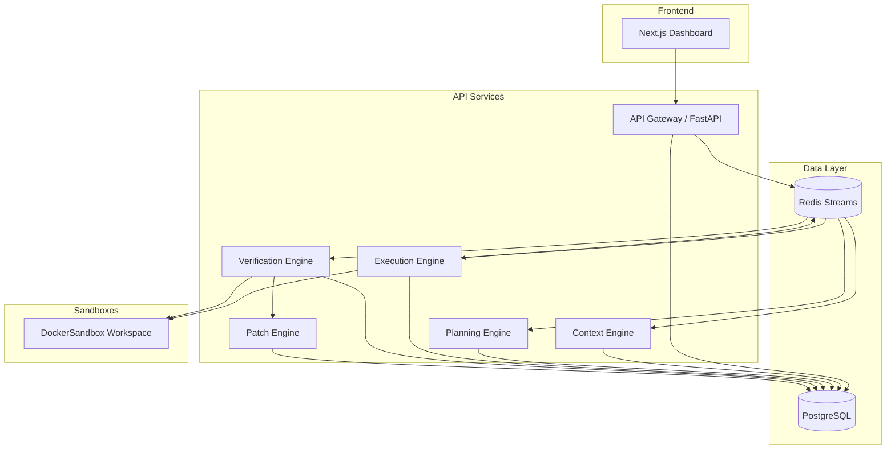
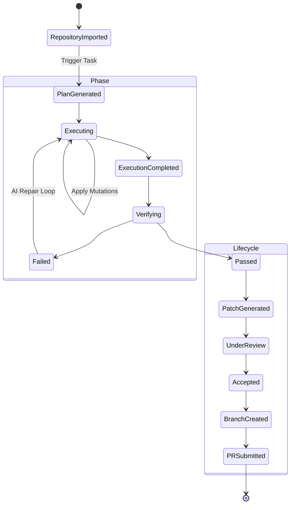

# Forge AI

Forge AI is a distributed, agentic continuous integration and continuous deployment (CI/CD) system designed to automate software engineering tasks. It securely executes autonomous AI agents within Docker-isolated environments to review code, generate patches, verify builds, and create pull requests.

## System Architecture

The Forge AI architecture is composed of several independent services communicating asynchronously to ensure reliability, fault tolerance, and secure execution.



## Lifecycle Flow

Forge AI manages a complete lifecycle for each task. The system processes incoming requests, plans an execution graph, mutates the codebase safely, verifies the changes, and orchestrates the final patch submission.



## Core Components

### 1. Planning Engine
The Planning Engine analyzes the incoming intent and codebase context to construct a Directed Acyclic Graph (DAG) of actionable tasks. It ensures dependencies are respected before execution begins.

### 2. Execution Engine
The Execution Engine traverses the planned DAG. For each node, it spawns a `DockerSandbox` environment. The sandbox isolates the execution, preventing any unauthorized network access or host system modifications. All file changes are captured as granular diffs (`MutationModel`).

### 3. Verification Engine
Once execution completes, the Verification Engine runs configured checks (linting, type-checking, tests, build) inside the isolated sandbox. If any checks fail, a Repair Loop is triggered, feeding the diagnostic logs back into the AI context for correction.

### 4. Patch Engine
Upon successful verification, the Patch Engine aggregates all mutations into a single `PatchModel`. It handles the Git lifecycle: checking out a branch, applying the unified diff, committing, and pushing the changes to the upstream repository.

## Development Setup

### Prerequisites
- Python 3.12+
- Node.js 20+
- Docker (for isolated sandbox execution)
- PostgreSQL
- Redis

### Installation

1. Clone the repository and configure the environment:
```bash
git clone https://github.com/Surya270106/Forge.git
cd Forge
cp .env.example .env
```

2. Initialize the backend:
```bash
uv sync
uv run alembic upgrade head
```

3. Initialize the frontend:
```bash
cd apps/frontend
npm install
npm run dev
```

### Infrastructure

The project includes a `docker-compose.yml` to spin up local instances of PostgreSQL and Redis:

```bash
docker compose up -d
```

## Configuration

Forge AI supports repository-specific configuration via a `forge.yaml` file located in the root of the target repository. This configuration defines the verification steps, including formatters, linters, and test runners.

## Security

Security is a foundational tenet of Forge AI. 
- All AI-generated code is executed within ephemeral, network-disabled Docker containers (`DockerSandbox`).
- Database access is scoped using Row-Level Security (RLS) to ensure strict tenant isolation.
- Interactions with external APIs (like GitHub) use least-privilege OAuth tokens scoped precisely to the target repository.

## Contribution

Code contributions are managed via Pull Requests. Ensure all new code is covered by tests and passes the existing linting rules (`ruff` for Python, `eslint` for TypeScript).

## License

Copyright (c) 2026 Surya270106. All rights reserved.
