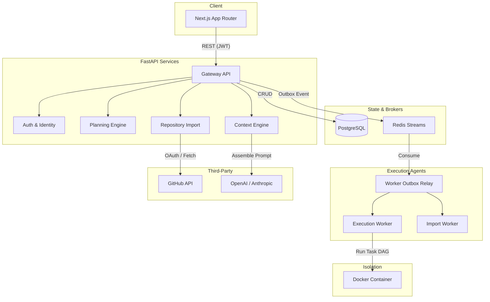
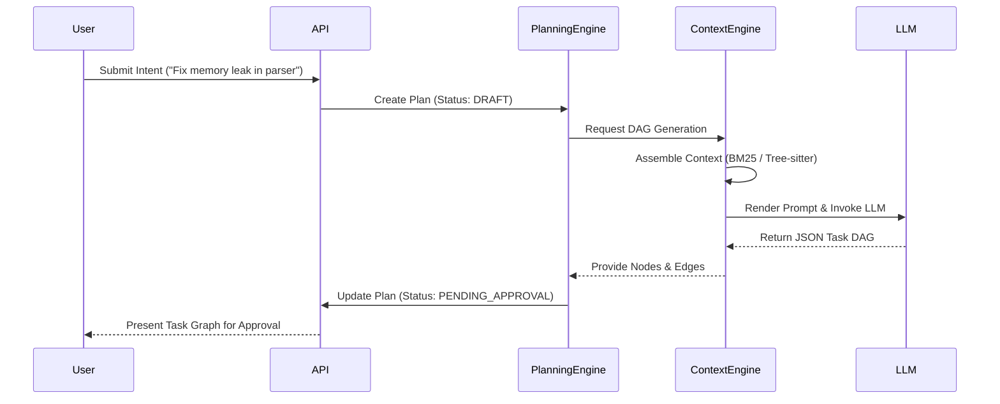
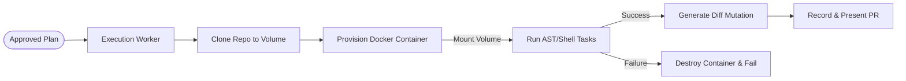

<div align="center">
  
  <h1>Forge AI</h1>
  <p><strong>The Autonomous AI Software Engineering Platform</strong></p>
  <p>
    <a href="#features">Features</a> •
    <a href="#architecture">Architecture</a> •
    <a href="#workflow">Workflow</a> •
    <a href="#getting-started">Getting Started</a>
  </p>
</div>

---

**Forge AI** is an enterprise-grade AI-assisted software engineering platform that securely manages autonomous coding workflows. Designed for product-minded teams, Forge transforms raw intents into fully-executed, verified code changes. It integrates directly with GitHub, analyzes massive codebases securely, and safely applies modifications through an isolated Docker Sandbox.

## Features

- **Real GitHub Integration**: Securely connect via OAuth and import your repositories (Public or Private) directly.
- **AI Planning Engine**: Leverages an AI Context Engine to dynamically construct a Directed Acyclic Graph (DAG) of execution tasks based on natural language intent.
- **Bring Your Own Provider**: Configure your workspace with your preferred AI provider (`OpenAI`, `Anthropic`) and model (`gpt-4o`, `claude-3-5-sonnet`).
- **Human-in-the-loop**: Full execution transparency. Review, edit, and approve AI-generated plans before any code is mutated.
- **Docker-Isolated Execution**: Tasks are run safely within a secure Docker Sandbox preventing host machine access or network tampering.
- **Live Event Streaming**: Watch your autonomous agent provision environments, clone repositories, and apply mutations in real-time.

---

## Architecture

Forge AI is designed around an event-driven, decoupled architecture separating the state management (API) from resource-heavy execution (Workers). 



### The AI Planning Workflow

The Planning Engine and Context Engine work in tandem to construct deterministic DAGs.



### Docker-Isolated Execution

Once approved, tasks run within an ephemeral, secure sandbox.



---

## Getting Started (Local Development)

### Prerequisites
- Python 3.12+ (Use `uv` for lightning-fast dependency management)
- Node.js v20+ 
- PostgreSQL 15+
- Redis 7+
- Docker Engine (Required for Execution Sandboxes)

### 1. Environment Setup

Clone the repository and set up your environment variables.
```bash
git clone https://github.com/your-org/Forge.git
cd Forge
cp .env.example .env
```
Make sure to add your `GITHUB_CLIENT_ID` and `GITHUB_CLIENT_SECRET` to the `.env` file to enable the GitHub OAuth flow.

### 2. Install Dependencies

```bash
# Install Python Backend
uv sync --frozen --all-extras

# Install Next.js Frontend
cd apps/frontend
npm ci
```

### 3. Initialize Databases

Ensure PostgreSQL and Redis are running locally.
```bash
# Run Alembic migrations and seed base roles
python scripts/database/reset_db.py --confirm
```

### 4. Run the Stack

You will need three terminal instances to run the full stack:

**Terminal 1: FastAPI Backend**
```bash
uv run uvicorn apps.api.main:app --port 8000 --reload
```

**Terminal 2: Redis Worker (Execution Engine)**
```bash
uv run python -m apps.worker.main
```

**Terminal 3: Next.js Frontend**
```bash
cd apps/frontend
npm run dev
```

Visit `http://localhost:3000` to log in via GitHub and start building!

---

## Security & Limitations

- **Sandboxing**: `DockerSandbox` is used for isolation. The container is stripped of capabilities and runs in a separate network bridge.
- **Provider Keys**: OpenAI / Anthropic API keys are strictly maintained in the encrypted PostgreSQL `OrganizationModel.provider_config` column and never exposed to the frontend browser context.
- **Local Workspaces**: Local workspace directories are isolated by `organization_id` and `repository_id` to prevent cross-tenant path traversal.

## Roadmap
- [x] Full Internal Alpha
- [x] Docker-Isolated Alpha
- [x] Real GitHub Connection
- [x] BYOK AI Provider Integration
- [ ] Comprehensive Tree-sitter Codebase Indexing (In Progress)
- [ ] Firecracker MicroVM Support (Deferred)

---
*Forge AI is built by product engineers for product engineers.*
