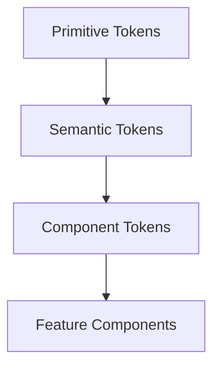
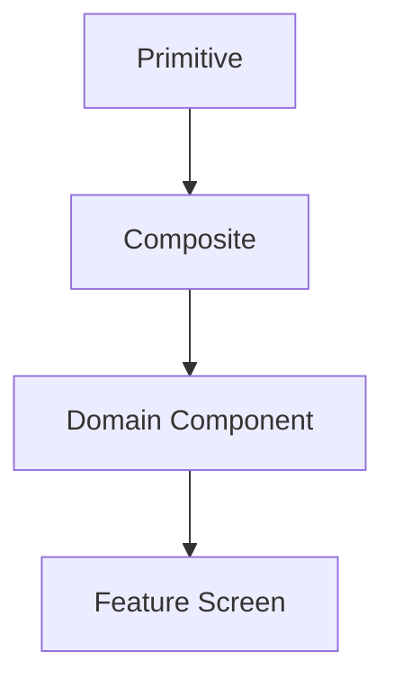

# RFC-007 — Part 2
# Design System, Component Architecture, Motion, Accessibility & Theming

**Status:** Draft for implementation  
**RFC Owner:** Forge Frontend Platform  
**Audience:** Frontend engineers, product designers, accessibility reviewers, QA engineers, staff engineers  
**Depends On:** RFC-001 through RFC-006, RFC-007 Part 1  
**Target Stack:** Next.js App Router, React, TypeScript, Tailwind CSS or token-compatible styling layer, Radix primitives, React Aria where appropriate  
**Normative Language:** MUST, SHOULD, MAY are used as defined by RFC 2119.

---

## 1. Executive Summary

This document defines the visual and interaction foundation of Forge AI.

Forge is not a generic SaaS dashboard. It is a developer workspace for planning,
executing, inspecting, verifying, and repairing repository changes. The design
system must therefore optimize for:

- dense technical information without visual noise
- clear distinction between AI suggestions and verified facts
- real-time execution feedback
- safe approval flows
- keyboard-driven operation
- readable code and logs
- deterministic visual states
- excellent dark and light themes
- accessibility under high information density

The design system is treated as infrastructure. Product teams consume stable
tokens, primitives, patterns, and interaction contracts. They must not invent
new visual behavior per feature.

---

## 2. Design Objectives

The frontend MUST communicate five things at all times:

1. **Where the user is**
2. **What Forge is doing**
3. **What changed**
4. **How confident Forge is**
5. **What action is safe next**

Every screen MUST prioritize operational clarity over decoration.

### 2.1 Core Design Principles

#### Principle A — State before style

Visuals must first communicate state:

- idle
- loading
- queued
- planning
- executing
- verifying
- repairing
- blocked
- failed
- completed
- cancelled

#### Principle B — Provenance is visible

Any claim, recommendation, diff, plan, or decision generated by an AI model must
show provenance when inspected:

- model
- prompt version
- context snapshot
- confidence
- generation timestamp
- validation status

#### Principle C — Destructive actions require friction

Actions affecting branches, repository files, credentials, deployments, or
external systems MUST use explicit confirmation patterns.

#### Principle D — Motion explains transitions

Animations may explain state changes but MUST NOT delay operation.

#### Principle E — The interface should feel calm under load

Execution may produce hundreds of events. The UI must summarize aggressively,
allow drill-down, and avoid visual chaos.

---

## 3. Token Architecture

The design system uses semantic tokens rather than direct color or spacing
values inside feature code.



### 3.1 Primitive Token Categories

- color
- spacing
- typography
- radius
- shadow
- border
- motion
- z-index
- breakpoints
- container widths

### 3.2 Semantic Token Categories

- background
- surface
- foreground
- muted
- border
- accent
- success
- warning
- danger
- info
- code
- diff-added
- diff-removed
- diff-modified
- focus-ring
- overlay

### 3.3 Component Token Categories

Examples:

- button-primary-bg
- button-primary-fg
- sidebar-active-bg
- execution-running-border
- code-line-highlight
- status-error-icon
- toast-warning-bg

Feature components MUST reference semantic or component tokens, never raw
hexadecimal or RGB values.

---

## 4. OKLCH Color System

Forge SHOULD use OKLCH because it provides perceptually consistent lightness and
better control over theme contrast.

Example token shape:

```css
:root {
  --background: 0.985 0.005 250;
  --surface: 0.970 0.008 250;
  --foreground: 0.205 0.015 255;
  --muted-foreground: 0.510 0.020 255;
  --border: 0.885 0.010 250;
  --accent: 0.610 0.190 265;
  --success: 0.690 0.145 150;
  --warning: 0.790 0.145 80;
  --danger: 0.630 0.220 25;
}
```

The exact production values must be contrast-tested.

### 4.1 Semantic State Colors

| State | Meaning | Usage |
|---|---|---|
| Neutral | No action required | metadata, idle status |
| Info | Informational | tips, context notices |
| Success | Verified success | passed checks, completed execution |
| Warning | Risk or attention | degraded provider, low confidence |
| Danger | Failure or destructive risk | failed verification, blocked action |
| Accent | Primary interactive focus | selected items, primary action |

### 4.2 AI-Specific Semantics

Forge introduces distinct semantics for AI-generated content:

- `ai-suggestion`
- `ai-reasoning`
- `ai-confidence-high`
- `ai-confidence-medium`
- `ai-confidence-low`
- `ai-unverified`
- `ai-verified`

AI colors MUST NOT be confused with success colors. AI-generated does not imply
correct.

---

## 5. Theme Architecture

Supported modes:

- light
- dark
- system

Theme state SHOULD be stored locally and synchronized with the server profile
when authenticated.

### 5.1 Theme Requirements

- no flash of incorrect theme
- theme applied before first meaningful paint
- code editor theme synchronized
- charts use semantic tokens
- diff colors preserve accessibility
- browser native controls respect color scheme

### 5.2 Dark Mode

Dark mode is a first-class design target, not an inversion of light mode.

Requirements:

- avoid pure black for main surfaces
- preserve hierarchy through subtle lightness differences
- avoid excessive saturated borders
- ensure code syntax remains readable
- use elevated surfaces sparingly

---

## 6. Typography System

The typography system supports interface text, technical metadata, logs, and
code.

### 6.1 Font Roles

- **UI Sans:** navigation, controls, body text
- **Display Sans:** major page titles and product moments
- **Monospace:** code, logs, identifiers, hashes, paths, commands

### 6.2 Type Scale

| Token | Typical Size | Usage |
|---|---:|---|
| display-xl | 48–56px | marketing-only hero |
| display-lg | 36–44px | high-level empty states |
| heading-xl | 28–32px | page title |
| heading-lg | 22–24px | section title |
| heading-md | 18–20px | card title |
| body-lg | 16–18px | prominent body |
| body-md | 14–16px | default |
| body-sm | 12–14px | secondary content |
| label | 12–13px | controls |
| mono-sm | 12–13px | logs and code metadata |

### 6.3 Typography Rules

- body text line length SHOULD remain between 55 and 85 characters
- uppercase should be limited to compact metadata labels
- code identifiers MUST preserve case
- long repository paths MUST truncate from the middle
- timestamps SHOULD use tabular numerals

---

## 7. Spacing and Layout Tokens

Forge uses a 4px base grid with common 8px rhythm.

Recommended scale:

```text
0, 2, 4, 6, 8, 12, 16, 20, 24, 32, 40, 48, 64, 80, 96
```

### 7.1 Density Modes

Forge MAY support:

- comfortable
- compact

Compact mode is useful for logs, tables, and large repositories. It must not
reduce target sizes below accessibility minimums.

---

## 8. Radius, Border, and Elevation

### 8.1 Radius Scale

- `radius-xs`: 4px
- `radius-sm`: 6px
- `radius-md`: 8px
- `radius-lg`: 12px
- `radius-xl`: 16px
- `radius-full`: pills and avatars only

### 8.2 Elevation

Elevation SHOULD be communicated through combinations of:

- surface lightness
- border contrast
- subtle shadow
- spatial separation

Heavy shadows are discouraged.

---

## 9. Iconography

Icon rules:

- use one primary icon family
- default stroke width must be visually consistent
- status icons must have text labels or tooltips
- icons must not be the only indicator of state
- destructive actions use explicit labels where space permits
- animated icons must respect reduced-motion preferences

---

## 10. Component Layering



### 10.1 Primitives

Examples:

- Button
- Input
- Textarea
- Select
- Checkbox
- RadioGroup
- Switch
- Tooltip
- Popover
- Dialog
- Sheet
- Tabs
- Badge
- Separator
- ScrollArea
- Skeleton
- Progress
- Toast

### 10.2 Composite Components

Examples:

- SearchCommand
- StatusBanner
- EmptyState
- FilterBar
- DataTable
- ConfirmationDialog
- InlineEditor
- CodeBlock
- DiffViewer
- EventTimeline
- ActivityFeed

### 10.3 Domain Components

Examples:

- RepositoryCard
- PlanGraph
- ExecutionStep
- VerificationResult
- ContextInspector
- ProviderStatus
- ConfidenceIndicator
- ApprovalGate
- RepairAttemptCard

---

## 11. Button Contract

Button variants:

- primary
- secondary
- ghost
- outline
- destructive
- success
- link

States:

- default
- hover
- active
- focus-visible
- disabled
- loading

Rules:

- loading buttons preserve width
- disabled is not used to hide missing permissions
- destructive buttons require explicit wording
- icon-only buttons require accessible names
- primary actions should be limited to one per local decision area

---

## 12. Forms

Forms MUST support:

- client validation
- server validation
- inline error summaries
- keyboard navigation
- pending state
- retry
- field-level help
- unsaved-change warnings

### 12.1 Error Messaging

Errors must explain:

1. what happened
2. why it may have happened
3. what the user can do next

Bad:

> Invalid request

Good:

> Forge could not import this repository because the GitHub token does not have
> access. Reconnect GitHub with repository permissions and retry.

---

## 13. Dialogs, Sheets, and Overlays

Use a dialog when the user must make a focused decision.

Use a sheet for:

- inspectors
- details
- contextual configuration
- non-blocking workflows

Use a full-page route for complex tasks.

### 13.1 Focus Management

- focus moves into open overlay
- focus is trapped
- escape closes non-destructive overlays
- focus returns to the initiating control
- destructive dialogs require deliberate confirmation

---

## 14. Navigation System

Primary navigation:

- Home
- Repositories
- Runs
- Plans
- Verification
- Analytics
- Settings

Contextual navigation appears for active repositories and executions.

### 14.1 Sidebar Behavior

Desktop:

- expanded
- collapsed
- remembered preference

Tablet:

- compact overlay or rail

Mobile:

- sheet-based navigation

### 14.2 Breadcrumbs

Breadcrumbs are required when hierarchy depth exceeds one.

Example:

```text
Repositories / forge-ai / Runs / run_01J... / Verification
```

---

## 15. Command Palette

The command palette is a core workflow.

Capabilities:

- navigate
- search repositories
- open recent runs
- trigger safe actions
- copy identifiers
- switch theme
- open documentation
- filter by command category

Keyboard shortcut:

```text
Ctrl/Cmd + K
```

Commands must be permission-aware and state-aware.

---

## 16. Motion System

Motion tokens:

- instant: 0ms
- fast: 100–150ms
- standard: 180–240ms
- deliberate: 280–360ms

Easing categories:

- enter
- exit
- move
- emphasis

### 16.1 Motion Rules

Motion may indicate:

- loading progression
- expansion
- reordering
- status transition
- relationship between source and destination

Motion must not:

- distract from logs
- animate every list item during high-volume events
- prevent interaction
- obscure failure states

### 16.2 Reduced Motion

When `prefers-reduced-motion` is enabled:

- use fades instead of spatial movement
- disable looping non-essential animation
- avoid animated gradients
- preserve progress information through text

---

## 17. Data Visualization

Supported chart categories:

- execution duration
- verification pass rate
- token usage
- cost by provider
- repository activity
- repair success rate
- queue latency

Rules:

- charts require text summaries
- colors must remain semantically stable
- legends must be accessible
- axes must not be misleading
- charts must support keyboard focus where interactive

---

## 18. Code and Diff Presentation

Code is a primary content type.

### 18.1 Code Viewer

Requirements:

- syntax highlighting
- line numbers
- copy action
- deep-linkable lines
- file path
- language label
- wrap toggle
- search
- virtualized rendering for large files

### 18.2 Diff Viewer

Modes:

- unified
- split

Annotations:

- AI rationale
- verification warning
- user comment
- repair origin
- confidence

Diff colors must be readable in both themes.

---

## 19. Status Components

### 19.1 Execution Status

- queued
- initializing
- running
- waiting_approval
- verifying
- repairing
- completed
- failed
- cancelled

### 19.2 Status Badge Rules

Every badge includes:

- semantic color
- icon
- readable label
- optional tooltip

Do not rely on color alone.

---

## 20. Loading Patterns

Use:

- skeletons for predictable layouts
- progress bars for measurable work
- spinners for brief indeterminate work
- activity timelines for multi-stage tasks

Avoid replacing an entire page with a centered spinner when the surrounding
navigation can remain interactive.

---

## 21. Empty States

Empty states must explain:

- what the area contains
- why it is empty
- what the user can do

Examples:

- no repositories connected
- no runs started
- no verification failures
- no providers configured

---

## 22. Error Boundaries

Error levels:

- component
- section
- route
- application

Each level should preserve as much usable UI as possible.

Error boundaries must capture:

- error identifier
- route
- user action
- correlation ID
- release version

---

## 23. Accessibility Standard

Forge targets WCAG 2.2 AA.

Mandatory requirements:

- keyboard operability
- visible focus
- semantic landmarks
- accessible names
- minimum contrast
- error identification
- reduced motion
- screen reader announcements for live updates
- target size compliance
- no keyboard traps

### 23.1 Live Regions

Execution and verification updates should use controlled live regions.

Do not announce every log line. Announce meaningful transitions such as:

- planning completed
- approval required
- verification failed
- repair succeeded
- execution completed

---

## 24. Responsive Strategy

Breakpoints are based on layout needs, not device names.

Typical ranges:

- compact: <640px
- narrow: 640–899px
- standard: 900–1279px
- wide: 1280–1599px
- ultra-wide: ≥1600px

### 24.1 Multi-Pane Workspaces

Wide screens may show:

- navigation
- primary content
- inspector

On smaller screens, inspectors become sheets or routes.

---

## 25. Component API Standards

Every reusable component must define:

- props interface
- controlled/uncontrolled behavior
- default behavior
- accessibility contract
- loading behavior
- error behavior
- test coverage
- visual examples

Components should prefer composition over large configuration objects.

---

## 26. Storybook and Documentation

Every primitive and composite component must have stories covering:

- default
- disabled
- loading
- error
- long content
- empty content
- dark mode
- compact mode
- keyboard interaction

Visual regression tests SHOULD run on pull requests.

---

## 27. Quality Gates

A component cannot be promoted to stable unless:

- API is documented
- accessibility test passes
- keyboard test passes
- unit tests pass
- visual regression is approved
- dark and light themes are reviewed
- responsive behavior is reviewed
- no raw design values exist in feature code

---

## 28. Acceptance Criteria

RFC-007 Part 2 is complete when:

- semantic tokens are defined
- light and dark themes are production-ready
- primitives are implemented
- composite patterns are documented
- motion rules are enforced
- code and diff views are accessible
- Storybook coverage exists
- keyboard navigation works
- WCAG 2.2 AA audit passes
- visual regression is automated

---

## 29. Implementation Checklist

- [ ] token package created
- [ ] theme initialization prevents flash
- [ ] primitive component library created
- [ ] status system standardized
- [ ] command palette implemented
- [ ] code viewer implemented
- [ ] diff viewer implemented
- [ ] accessibility linting enabled
- [ ] Storybook integrated
- [ ] visual tests integrated
- [ ] reduced motion validated
- [ ] compact density mode reviewed

---

**End of RFC-007 Part 2**
