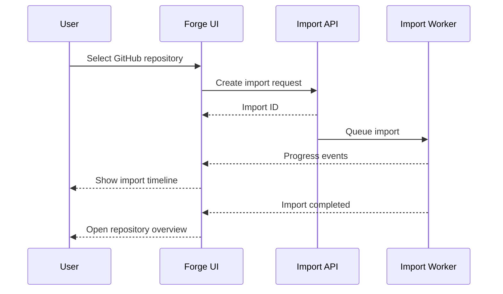
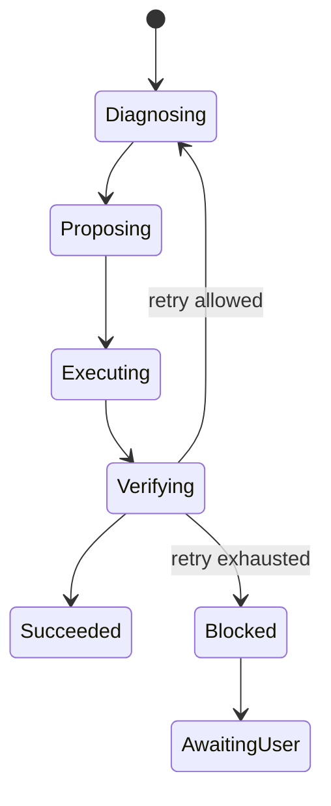

# RFC-007 — Part 3
# Product Workflows, Repository Experience, Planning, Execution & Verification UX

**Status:** Draft for implementation  
**Audience:** Product engineering, frontend engineering, backend engineering, design, QA  
**Depends On:** RFC-001 through RFC-006, RFC-007 Parts 1–2

---

## 1. Executive Summary

This document defines the primary product workflows of Forge AI.

The interface must allow a developer to move from repository connection to
verified code changes without losing control or understanding. Forge may automate
complex work, but the user must remain able to inspect decisions, approve risk,
interrupt execution, and understand results.

The central UX model is:

```text
Connect → Understand → Plan → Approve → Execute → Verify → Repair → Review
```

Each stage exposes progressive detail.

---

## 2. Information Architecture

### 2.1 Global Areas

- Home
- Repositories
- Plans
- Runs
- Verification
- Analytics
- Settings

### 2.2 Repository Workspace

Repository-scoped navigation:

- Overview
- Architecture
- Symbols
- Dependencies
- Plans
- Runs
- Verification
- Context
- Settings

### 2.3 Run Workspace

Run-scoped navigation:

- Summary
- Plan
- Execution
- Changes
- Verification
- Context
- Events
- Audit

---

## 3. Home Dashboard

The home dashboard answers:

- what needs attention
- what recently completed
- what is currently running
- which repositories are unhealthy
- whether providers or infrastructure are degraded

### 3.1 Dashboard Sections

1. attention queue
2. active runs
3. recent repositories
4. verification failures
5. system status
6. recent activity

### 3.2 Attention Queue

Examples:

- plan approval required
- execution blocked
- verification failed
- GitHub connection expired
- provider degraded
- merge conflict detected

Items should be sorted by:

1. severity
2. age
3. repository priority
4. user ownership

---

## 4. Repository Import Flow

### 4.1 Flow



### 4.2 Import Steps Shown to User

- validating access
- cloning
- scanning files
- detecting languages
- parsing manifests
- building repository memory
- building dependency graph
- indexing symbols
- ready

### 4.3 Failure UX

The UI must distinguish:

- authentication failure
- permission failure
- repository too large
- unsupported Git object
- network failure
- parser failure
- indexing failure

Each failure includes an actionable next step.

---

## 5. Repository Overview

Primary cards:

- languages
- frameworks
- repository health
- architecture summary
- recent activity
- indexed symbols
- dependency risk
- test coverage estimate
- latest memory version

### 5.1 Architecture Map

The architecture map is an interactive graph.

Capabilities:

- zoom and pan
- filter by layer
- group by directory
- inspect symbols
- show dependencies
- highlight cycles
- open source
- generate scoped context

The graph must be progressively loaded for large repositories.

---

## 6. Repository Search

Search scope:

- files
- symbols
- functions
- classes
- endpoints
- database models
- tests
- documentation
- plans
- runs

Search supports:

- fuzzy text
- exact symbol
- path filter
- language filter
- type filter
- semantic search

Results must explain why they matched.

---

## 7. Task Creation

The user creates a task through natural language.

Examples:

- add rate limiting to authentication endpoints
- fix failing checkout tests
- migrate database access to repository pattern
- explain how the billing webhook works

### 7.1 Task Composer

Elements:

- task description
- repository
- branch
- execution mode
- scope constraints
- risk tolerance
- provider preference
- attachments
- acceptance criteria

### 7.2 Execution Modes

- explain only
- plan only
- plan and request approval
- execute in sandbox
- execute and create branch
- execute and open pull request

Default should be conservative.

---

## 8. Intent Clarification UX

When the planner detects ambiguity, it may ask targeted questions.

Rules:

- ask only questions that materially affect the plan
- show why the answer matters
- provide recommended defaults
- avoid repeated questions
- preserve prior answers

Example:

> Should Forge modify the shared authentication middleware or only the checkout
> route? Modifying the middleware affects 14 endpoints.

---

## 9. Plan Review

The plan is one of the most important screens.

### 9.1 Plan Summary

- objective
- proposed approach
- affected files
- risk
- estimated duration
- estimated token usage
- verification strategy
- rollback strategy

### 9.2 Plan Graph

The DAG visually shows:

- task nodes
- dependencies
- parallel steps
- approval gates
- verification nodes
- rollback boundaries

Node states:

- proposed
- approved
- queued
- running
- completed
- failed
- skipped
- cancelled

### 9.3 Plan Diff

When a plan changes, the user must see:

- added steps
- removed steps
- modified dependencies
- changed risk
- changed file scope
- reason for replanning

### 9.4 Approval Gates

Approval types:

- low-risk batch approval
- file scope approval
- dependency installation approval
- schema migration approval
- external service approval
- production-impact approval

---

## 10. Execution Workspace

The execution workspace is a real-time operational view.

### 10.1 Layout

Wide screen:

```text
┌──────────┬───────────────────────────────┬───────────────┐
│ Run Nav  │ Execution Timeline            │ Inspector     │
│          │                               │               │
│          │ Active Step                   │ Files         │
│          │ Logs                          │ Context       │
│          │ Progress                      │ Metadata      │
└──────────┴───────────────────────────────┴───────────────┘
```

### 10.2 Execution Timeline

Each step shows:

- name
- status
- start time
- duration
- worker
- tool
- retries
- output summary

### 10.3 Live Logs

Requirements:

- stream incrementally
- preserve ordering
- pause auto-scroll
- search
- filter severity
- download
- copy selected range
- virtualize large output

### 10.4 User Controls

- pause
- cancel
- approve
- reject
- retry
- skip optional step
- open inspector

Controls must reflect backend capability. The UI must not imply that an
operation is reversible when it is not.

---

## 11. Approval Experience

Approval requests must contain enough context to make a safe decision.

Required:

- requested action
- reason
- affected assets
- risk
- rollback capability
- alternatives
- recommended option
- expiry, if any

Example:

> Forge wants to add `redis` as a production dependency to implement distributed
> rate limiting. This changes `package.json` and the lockfile. No infrastructure
> deployment will occur.

Approval decisions are audit logged.

---

## 12. Change Review

### 12.1 File Tree

The change tree groups:

- added
- modified
- deleted
- renamed

Files may be grouped by:

- directory
- plan step
- risk
- verification result

### 12.2 Diff Review

Users can:

- comment
- accept file
- reject file
- request repair
- jump to related verification
- inspect rationale
- view original context

### 12.3 AI Rationale

Rationale must be concise by default and expandable.

It should answer:

- why this file changed
- why this implementation was chosen
- what alternatives were rejected
- what risks remain

---

## 13. Verification Workspace

Verification categories:

- formatting
- lint
- type checking
- unit tests
- integration tests
- build
- security
- policy
- custom checks

### 13.1 Verification Summary

Show:

- total checks
- passed
- failed
- skipped
- duration
- confidence
- blocking status

### 13.2 Failure Presentation

A failure must link:

- failing command
- relevant output
- affected files
- probable root cause
- repair attempts
- related plan step

### 13.3 Verification Matrix

```text
Check             Status   Duration   Blocking
------------------------------------------------
Formatting        Passed      4s       Yes
Lint              Passed     11s       Yes
Type Check        Failed     19s       Yes
Unit Tests        Skipped     -        Yes
Security Scan     Passed      8s       No
```

---

## 14. Repair Experience

Repair cycles are grouped by failure.

Each attempt shows:

- diagnosis
- proposed repair
- changed files
- result
- confidence
- whether the failure changed

Maximum repair limits must be visible.

### 14.1 Repair State Machine



---

## 15. Context Inspector

The context inspector explains what the model saw.

Sections:

- selected files
- selected symbols
- graph neighbors
- related tests
- repository metadata
- omitted context
- token budget
- prompt template
- model route

The inspector must not expose secrets.

### 15.1 Ranking Explanation

For each included item:

- final score
- graph distance
- symbol relevance
- semantic similarity
- recency
- test relationship

---

## 16. Confidence UX

Confidence must not be presented as certainty.

Display:

- numeric score
- qualitative label
- contributing factors
- uncertainty
- recommended user action

Example:

```text
Confidence: 0.82 — Medium
Reason: strong symbol match, but incomplete test coverage.
Recommendation: review the authentication middleware changes before execution.
```

---

## 17. Notifications

Notification categories:

- action required
- run completed
- run failed
- verification blocked
- provider degraded
- repository disconnected

Channels:

- in-app
- email
- optional Slack or webhook in future RFCs

Notifications must be deduplicated.

---

## 18. Activity and Audit Timeline

Every meaningful action appears in the audit timeline:

- user task created
- plan generated
- plan approved
- execution started
- file changed
- verification executed
- repair attempted
- branch created
- pull request opened
- user cancelled

Events are filterable by actor and category.

---

## 19. Analytics Experience

Initial metrics:

- runs completed
- success rate
- verification pass rate
- repair success rate
- average duration
- average token use
- cost by provider
- approval frequency
- failure categories

Analytics should support repository and time range filters.

---

## 20. Settings UX

Settings categories:

- profile
- appearance
- GitHub
- repositories
- providers
- execution
- approvals
- notifications
- security
- data retention

Settings that affect risk must include explanations.

---

## 21. Permissions and Role-Aware UX

Roles may include:

- owner
- admin
- developer
- reviewer
- viewer

The UI must:

- hide inaccessible navigation where appropriate
- show permission reasons when useful
- never rely on client enforcement
- reflect server authorization errors
- audit privileged actions

---

## 22. Mobile and Narrow Layouts

Forge is primarily desktop-first, but narrow layouts must support:

- reviewing run status
- approving or rejecting gates
- viewing verification summaries
- receiving notifications
- reading diffs in unified mode

Complex graph editing is not required on mobile.

---

## 23. Failure and Recovery UX

### 23.1 Connection Loss

When real-time connection fails:

- show stale indicator
- attempt reconnection
- preserve current state
- poll as fallback
- reconcile missed events

### 23.2 Partial Backend Failure

Example:

- logs unavailable
- execution state still available
- provider health unavailable

The page should degrade by section, not fail entirely.

---

## 24. Deep Links

Deep links should support:

- repository
- symbol
- plan
- run
- plan step
- execution event
- changed file
- diff line
- verification check
- repair attempt

Links should remain stable across refreshes.

---

## 25. Keyboard Workflow

Recommended shortcuts:

| Shortcut | Action |
|---|---|
| `Cmd/Ctrl + K` | command palette |
| `G then R` | repositories |
| `G then U` | runs |
| `G then V` | verification |
| `J / K` | next/previous item |
| `A` | approve selected gate |
| `X` | reject selected gate |
| `/` | focus search |
| `Esc` | close inspector |

Shortcuts must avoid browser conflicts and be discoverable.

---

## 26. Product Telemetry

Track UX events such as:

- task_created
- plan_viewed
- plan_approved
- plan_rejected
- diff_opened
- context_inspected
- run_cancelled
- verification_failure_opened

Telemetry must exclude code and secrets by default.

---

## 27. Acceptance Criteria

RFC-007 Part 3 is complete when:

- repository import is fully observable
- task creation supports execution modes
- plan DAG is interactive
- approvals are explicit and auditable
- execution updates stream in real time
- file changes are reviewable
- verification failures are actionable
- repair attempts are inspectable
- context provenance is visible
- responsive fallback exists
- keyboard workflows are operational

---

## 28. Implementation Checklist

- [ ] dashboard
- [ ] repository import timeline
- [ ] repository overview
- [ ] architecture explorer
- [ ] task composer
- [ ] plan review
- [ ] approval gate
- [ ] run workspace
- [ ] live logs
- [ ] diff review
- [ ] verification workspace
- [ ] repair history
- [ ] context inspector
- [ ] audit timeline
- [ ] analytics baseline
- [ ] role-aware navigation

---

**End of RFC-007 Part 3**
