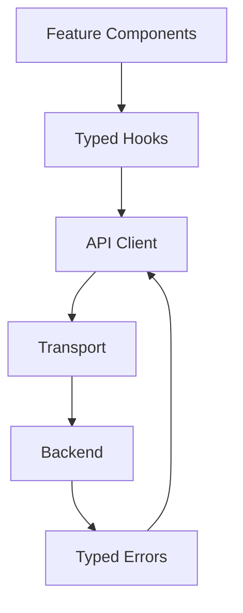

# RFC-007 — Part 4
# Frontend State, Data Access, Real-Time Events, API Clients & Offline Resilience

**Status:** Draft for implementation  
**Audience:** Frontend platform, backend API owners, staff engineers, QA  
**Depends On:** RFC-001 through RFC-006, RFC-007 Parts 1–3

---

## 1. Executive Summary

This RFC defines how the Forge frontend reads, caches, mutates, streams,
reconciles, and presents backend state.

Forge is event-heavy. A single execution may produce many transitions across
planning, execution, verification, repair, and provider systems. The frontend
must remain correct under:

- delayed events
- duplicate events
- out-of-order delivery
- reconnection
- partial API failure
- optimistic actions
- stale caches
- multiple browser tabs
- long-running tasks

The frontend state architecture is therefore designed around server authority,
typed contracts, idempotent event application, and deterministic reconciliation.

---

## 2. State Taxonomy

### 2.1 Server State

Examples:

- repositories
- plans
- runs
- verification checks
- provider health
- audit events

Managed through a server-state library such as TanStack Query.

### 2.2 Client State

Examples:

- active repository
- selected files
- inspector state
- table filters
- local draft

Managed through local React state or Zustand.

### 2.3 URL State

Examples:

- active tab
- filters
- selected run
- selected diff line
- time range

State that should survive refresh or be shareable belongs in the URL.

### 2.4 Ephemeral State

Examples:

- hover
- open menu
- pending tooltip
- drag state

Kept local to components.

---

## 3. Source of Truth Rules

1. Backend APIs are authoritative.
2. Real-time events update cached server state.
3. Optimistic state is temporary and reversible.
4. URL state is authoritative for navigation.
5. Component state must not duplicate server state.
6. Derived values should be computed, not persisted.

---

## 4. Query Key Architecture

Example hierarchy:

```ts
const keys = {
  repositories: {
    all: ['repositories'],
    detail: (id: string) => ['repositories', id],
    symbols: (id: string, filters: SymbolFilters) =>
      ['repositories', id, 'symbols', filters],
  },
  runs: {
    all: ['runs'],
    detail: (id: string) => ['runs', id],
    events: (id: string) => ['runs', id, 'events'],
    files: (id: string) => ['runs', id, 'files'],
  },
};
```

Rules:

- keys must be centralized
- parameters must be serializable
- object parameters must use stable ordering
- broad invalidation should be avoided

---

## 5. API Client Architecture



Layers:

1. transport
2. generated or hand-authored client
3. domain service
4. query/mutation hooks
5. feature component

Feature components must not construct URLs manually.

---

## 6. Contract Generation

Preferred options:

- OpenAPI-generated TypeScript clients
- shared schema package
- Zod runtime validation at boundaries

Compile-time typing is insufficient because deployed backend and frontend
versions may differ.

Responses should be validated at critical boundaries.

---

## 7. Error Model

Canonical client error:

```ts
type ForgeError = {
  code: string;
  message: string;
  retryable: boolean;
  status?: number;
  correlationId?: string;
  details?: Record<string, unknown>;
};
```

Categories:

- authentication
- authorization
- validation
- conflict
- rate limit
- unavailable
- timeout
- network
- unexpected

---

## 8. Query Defaults

Recommended defaults by data type:

### Static-ish data

Examples:

- prompt templates
- language metadata
- role definitions

Long stale time.

### Operational data

Examples:

- run status
- verification progress

Short stale time plus real-time events.

### Immutable data

Examples:

- published prompt snapshot
- historical audit event

Infinite stale time where safe.

---

## 9. Mutations

Every mutation must define:

- permission requirement
- optimistic strategy
- rollback strategy
- success invalidation
- error mapping
- audit expectation

### 9.1 Optimistic Mutation Example

Approving a plan gate may be optimistic if:

- request is idempotent
- UI can safely revert
- backend conflicts are explicit

Cancelling an execution should generally wait for backend acknowledgement
because cancellation may fail after the point of no return.

---

## 10. Idempotency

Mutation requests SHOULD send an idempotency key for:

- task creation
- plan approval
- execution start
- cancellation
- retry
- branch creation
- pull request creation

The frontend must reuse the same key when retrying the same user action.

---

## 11. Real-Time Transport

Preferred:

- WebSocket for bidirectional control and high event volume

Fallback:

- Server-Sent Events for stream-only channels
- polling when streaming is unavailable

### 11.1 Connection State

- connecting
- connected
- reconnecting
- degraded
- offline

Connection state must be visible in operational workspaces.

---

## 12. Event Envelope

```json
{
  "event_id": "evt_01...",
  "event_type": "execution.step.completed",
  "aggregate_type": "run",
  "aggregate_id": "run_01...",
  "aggregate_version": 18,
  "timestamp": "2026-07-19T12:00:00Z",
  "correlation_id": "cor_01...",
  "payload": {}
}
```

Required fields:

- globally unique event ID
- aggregate version
- timestamp
- correlation ID
- typed payload

---

## 13. Event Application

The client must handle:

- duplicate event IDs
- older aggregate versions
- version gaps
- unknown event types
- schema mismatch

Pseudocode:

```ts
function applyEvent(event: EventEnvelope) {
  if (seenEvents.has(event.event_id)) return;

  const localVersion = getAggregateVersion(event.aggregate_id);

  if (event.aggregate_version <= localVersion) {
    seenEvents.add(event.event_id);
    return;
  }

  if (event.aggregate_version > localVersion + 1) {
    scheduleReconciliation(event.aggregate_id);
    return;
  }

  updateCache(event);
  setAggregateVersion(event.aggregate_id, event.aggregate_version);
  seenEvents.add(event.event_id);
}
```

---

## 14. Reconciliation

Reconciliation occurs when:

- a version gap is detected
- reconnect succeeds
- tab returns from sleep
- visibility changes after a long pause
- server signals resync required

Process:

1. pause event application for aggregate
2. fetch authoritative snapshot
3. replace cache
4. update aggregate version
5. resume events
6. discard superseded buffered events

---

## 15. Event Subscription Strategy

Channels may be scoped by:

- user
- organization
- repository
- run

The client should subscribe only to relevant scopes.

Example:

```text
user:{user_id}
repository:{repository_id}
run:{run_id}
```

---

## 16. Event Backpressure

Large log streams can overwhelm rendering.

Strategies:

- buffer log events
- batch updates every 50–200ms
- virtualize rendered rows
- summarize hidden events
- prioritize state transitions over log lines
- persist raw logs server-side

---

## 17. Cross-Tab Coordination

Multiple tabs can cause duplicate connections and repeated notifications.

Options:

- BroadcastChannel
- SharedWorker
- leader tab election

At minimum, tabs should share:

- authentication changes
- theme
- notification read state
- connection health

---

## 18. Authentication State

Requirements:

- secure cookie-based session preferred
- CSRF protection
- silent session refresh where supported
- redirect preservation
- global logout propagation
- unauthorized query cancellation

Tokens must not be exposed to feature code.

---

## 19. Authorization

The frontend uses permissions for UX only.

Example permission model:

```ts
type Permission =
  | 'repository.read'
  | 'repository.manage'
  | 'plan.approve'
  | 'run.execute'
  | 'run.cancel'
  | 'settings.manage';
```

Backend remains authoritative.

---

## 20. Persistence

Local persistence may be used for:

- theme
- sidebar state
- recent repositories
- draft task text
- table density
- non-sensitive filters

Do not persist:

- provider credentials
- repository code
- prompts containing code
- private logs
- secrets
- authorization decisions

---

## 21. Offline Behavior

Forge is not fully offline-capable, but must degrade gracefully.

Offline-supported actions:

- view previously cached metadata
- inspect cached historical run summary
- draft a task locally
- browse cached navigation

Offline-blocked actions:

- start execution
- approve gate
- modify settings
- import repository
- create branch

The UI must clearly mark cached data as potentially stale.

---

## 22. Retry Strategy

Retry safe reads with exponential backoff and jitter.

Do not automatically retry:

- validation failures
- authorization failures
- destructive non-idempotent mutations
- business conflicts

Use `Retry-After` when provided.

---

## 23. Request Cancellation

Queries must be cancellable during:

- route transitions
- changed filters
- component teardown
- user cancellation

Search requests should debounce and cancel older requests.

---

## 24. Pagination

Use cursor pagination for:

- audit events
- logs
- runs
- repositories
- symbols

Avoid offset pagination for frequently changing collections.

---

## 25. Infinite Scrolling

Infinite scroll is appropriate for:

- logs
- audit history
- activity feeds

Explicit pagination is preferred for:

- administrative tables
- analytics reports
- settings data

---

## 26. Cache Invalidation Matrix

| Mutation | Update Directly | Invalidate |
|---|---|---|
| rename repository alias | repository detail | repository list |
| approve plan | plan detail | run readiness |
| cancel run | run detail | active runs |
| retry check | verification check | verification summary |
| update provider | provider detail | provider health |

---

## 27. Streaming AI Output

Streaming text may be used for:

- explanation
- plan generation progress
- diagnostics summary

Rules:

- stream is provisional
- final structured result replaces provisional text
- cancellation is supported
- partial content is not treated as validated
- structured output validation occurs after completion

---

## 28. Background Refresh

Refresh when:

- window regains focus
- network reconnects
- active run is open
- provider status screen is open

Avoid polling inactive tabs aggressively.

---

## 29. Performance Budgets

- API client overhead: <10ms
- cache update from event: <16ms for normal events
- event-to-visible-state p95: <250ms
- reconnect and reconcile p95: <3s
- log rendering: 60fps under expected volume
- search debounce: 150–250ms
- route data prefetch: where high-confidence

---

## 30. Observability

Frontend telemetry:

- request latency
- request failures
- retries
- websocket reconnects
- reconciliation count
- dropped event count
- event lag
- cache hit rate
- stale data duration
- render performance

Every API error should preserve correlation ID.

---

## 31. Testing Strategy

Unit:

- query key creation
- event reducers
- error normalization
- reconciliation logic

Integration:

- optimistic rollback
- reconnect
- version gap
- duplicate events
- out-of-order events
- expired session

End-to-end:

- create task
- approve plan
- receive live execution updates
- recover after connection loss
- review final verification

---

## 32. Acceptance Criteria

- server state is centrally managed
- API clients are typed
- runtime validation protects critical boundaries
- event application is idempotent
- version gaps trigger reconciliation
- connection state is visible
- cross-tab behavior is defined
- offline behavior is explicit
- retries are safe
- correlation IDs are preserved
- event-to-UI latency meets budget

---

## 33. Implementation Checklist

- [ ] centralized query keys
- [ ] typed client package
- [ ] normalized error model
- [ ] websocket manager
- [ ] event schema registry
- [ ] idempotent reducers
- [ ] reconciliation service
- [ ] cross-tab channel
- [ ] offline indicator
- [ ] request cancellation
- [ ] streaming output adapter
- [ ] telemetry hooks
- [ ] integration tests

---

**End of RFC-007 Part 4**
