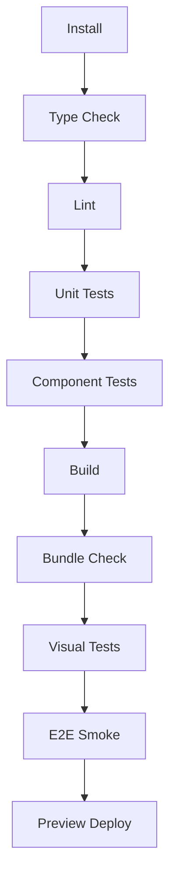

# RFC-007 — Part 5
# Performance, Testing, Security, Observability, Deployment & Production Readiness

**Status:** Draft for implementation  
**Audience:** Frontend platform, QA, security, infrastructure, SRE, product engineering  
**Depends On:** RFC-001 through RFC-006, RFC-007 Parts 1–4

---

## 1. Executive Summary

This document completes RFC-007.

It defines the engineering controls required to ship and operate the Forge
frontend as a production-grade application. It covers:

- performance budgets
- rendering architecture
- bundle governance
- security controls
- testing layers
- accessibility validation
- frontend observability
- release strategy
- deployment
- rollback
- incident response
- definition of done

The frontend is considered part of the operational system, not a static visual
layer.

---

## 2. Rendering Architecture

Use the Next.js App Router with deliberate separation between server and client
components.

### 2.1 Server Components

Use for:

- static layouts
- initial navigation
- server-authenticated metadata
- low-interactivity content
- preloaded route data where appropriate

### 2.2 Client Components

Use only where required:

- live execution updates
- editors
- graphs
- command palette
- drag interactions
- local form behavior
- WebSocket subscriptions

The `"use client"` boundary should be as low as practical.

---

## 3. Streaming and Suspense

Streaming may improve perceived performance for complex workspaces.

Recommended boundaries:

- repository summary
- architecture graph
- recent runs
- analytics cards
- verification history

Each boundary requires:

- meaningful skeleton
- isolated error state
- stable layout dimensions

---

## 4. Route Performance Budgets

| Route | LCP Target | JS Budget |
|---|---:|---:|
| Login | <1.5s | <150KB |
| Dashboard | <2.0s | <250KB |
| Repository Overview | <2.2s | <300KB |
| Run Workspace | <2.5s | <400KB |
| Diff Viewer | <2.5s | lazy-loaded |
| Analytics | <2.5s | lazy-loaded charts |

Budgets should be measured on realistic mid-range hardware and network profiles.

---

## 5. Core Web Vitals

Targets:

- LCP: good range
- INP: good range
- CLS: near zero
- TTFB: minimized for authenticated routes

Performance must be monitored in production, not only in Lighthouse.

---

## 6. JavaScript Governance

Rules:

- route-level code splitting
- dynamic import for graphing, editor, and charts
- avoid duplicate libraries
- avoid large date libraries
- tree-shake icons
- analyze bundle in CI
- define bundle regression thresholds

A pull request that increases a critical route beyond threshold requires explicit
approval.

---

## 7. Large Dataset Rendering

Virtualization is required for:

- logs
- symbol lists
- audit events
- large file trees
- long diffs
- execution timelines

Virtualized components must preserve:

- keyboard navigation
- screen reader usability where feasible
- deep-linking
- selection
- search highlighting

---

## 8. Image and Asset Strategy

- prefer SVG for icons and diagrams
- optimize raster assets
- avoid unbounded remote images
- use strict content security policy
- cache immutable assets
- fingerprint production assets

---

## 9. Frontend Security Model

Threat categories:

- XSS
- CSRF
- clickjacking
- token leakage
- malicious repository content
- unsafe Markdown
- unsafe terminal output
- dependency compromise
- open redirects
- insecure postMessage use

---

## 10. Untrusted Content

Repository files, logs, AI output, Markdown, and tool output are untrusted.

Requirements:

- escape HTML by default
- sanitize rendered Markdown
- disable raw HTML unless explicitly trusted
- sanitize ANSI sequences
- prevent clickable `javascript:` URLs
- isolate previews
- truncate pathological content
- block invisible control-character attacks where practical

---

## 11. Content Security Policy

Production should implement a restrictive CSP.

Example categories:

- default-src 'self'
- script-src with nonce or hash
- style-src controlled
- img-src allowlisted
- connect-src allowlisted for APIs and WebSockets
- frame-ancestors 'none' or controlled
- object-src 'none'
- base-uri 'self'

Exact policy depends on deployment.

---

## 12. Secret Handling

The browser must never receive:

- provider API secrets
- GitHub private keys
- database credentials
- infrastructure credentials
- encryption keys

Public environment variables must be explicitly classified.

---

## 13. Dependency Security

- lockfile required
- automated vulnerability scanning
- license policy
- dependency update review
- restricted postinstall scripts
- provenance where available
- minimal dependency surface

---

## 14. Testing Pyramid

### 14.1 Static Checks

- TypeScript strict mode
- ESLint
- formatting
- dependency rules
- accessibility lint
- forbidden import rules
- bundle analysis

### 14.2 Unit Tests

Cover:

- utilities
- reducers
- formatters
- event handlers
- permission logic
- validators

### 14.3 Component Tests

Cover:

- interaction
- accessibility
- loading
- error
- keyboard behavior
- responsive states

### 14.4 Integration Tests

Cover:

- API hooks
- cache invalidation
- real-time events
- optimistic updates
- authentication transitions

### 14.5 End-to-End Tests

Critical journeys:

1. authenticate
2. connect repository
3. create task
4. review plan
5. approve
6. observe execution
7. inspect diff
8. review verification
9. request repair
10. complete run

---

## 15. Test Environment

Test environment should support:

- seeded repositories
- deterministic event playback
- mocked provider responses
- simulated failures
- simulated latency
- permission roles
- feature flags

---

## 16. Visual Regression

Visual tests should cover:

- primary routes
- light and dark themes
- compact and comfortable density
- common viewport sizes
- error states
- loading states
- large content
- reduced motion

---

## 17. Accessibility Testing

Automated:

- axe
- linting
- color contrast checks

Manual:

- keyboard-only
- screen reader
- zoom to 200%
- reduced motion
- high contrast mode
- focus order
- live region behavior

No release should rely only on automated accessibility testing.

---

## 18. Browser Support

Define a documented support matrix.

Recommended:

- latest two stable Chrome
- latest two stable Edge
- latest two stable Firefox
- latest two stable Safari

Unsupported browsers should receive a clear message rather than silently failing.

---

## 19. Frontend Observability

### 19.1 Error Monitoring

Capture:

- uncaught exceptions
- unhandled rejections
- React boundary errors
- failed API requests
- failed dynamic imports
- WebSocket failures

### 19.2 Performance Monitoring

Capture:

- route load
- Web Vitals
- long tasks
- large renders
- event lag
- memory usage indicators
- bundle version

### 19.3 Session Context

Include:

- release version
- route
- user role
- repository ID where safe
- run ID
- correlation ID
- browser

Do not include source code or secrets.

---

## 20. Logging

Client logs should be structured.

Levels:

- debug
- info
- warn
- error

Production logging must be sampled and privacy-aware.

---

## 21. Feature Flags

Feature flags support:

- staged rollout
- experimentation
- emergency disable
- organization targeting
- role targeting

Flags must not be used as authorization.

Flag removal must be part of feature completion.

---

## 22. Release Strategy

Recommended environments:

- local
- preview
- staging
- production

Every pull request should create a preview deployment.

### 22.1 Promotion

```text
Pull Request
    ↓
Preview
    ↓
Automated Tests
    ↓
Staging
    ↓
Smoke Tests
    ↓
Production Canary
    ↓
Full Production
```

---

## 23. Deployment

The frontend may deploy to Vercel or equivalent edge-capable platform.

Requirements:

- immutable builds
- environment separation
- secure secrets
- rollback
- health checks
- release metadata
- source map protection
- preview access control for private projects

---

## 24. Version Compatibility

Frontend and backend versions may differ briefly during deployment.

The system must support:

- backward-compatible API changes
- capability negotiation
- unknown event handling
- graceful feature disable
- schema version reporting

---

## 25. Rollback

Rollback triggers:

- critical error spike
- authentication failure
- broken execution controls
- event reconciliation failure
- severe performance regression
- security issue

Rollback must be executable without rebuilding.

---

## 26. Incident Runbooks

### 26.1 Frontend Release Failure

1. halt rollout
2. compare release error rate
3. rollback
4. invalidate broken assets if required
5. verify authentication and run controls
6. publish incident note
7. create follow-up

### 26.2 WebSocket Degradation

1. activate polling fallback
2. show degraded connection state
3. monitor event lag
4. reconcile active runs
5. restore primary transport
6. verify missed event recovery

### 26.3 Authentication Failure

1. disable privileged actions
2. preserve safe read-only access if possible
3. force session refresh
4. show clear status
5. rollback recent auth changes if correlated

---

## 27. Service-Level Objectives

Suggested frontend SLOs:

- availability: 99.9%
- successful route loads: 99.8%
- critical mutation success excluding business errors: 99.5%
- active-run event freshness p95: <2s
- authentication success: 99.9%
- client crash-free sessions: >99.8%

---

## 28. CI Pipeline



Required gates:

- type check
- lint
- unit tests
- build
- security scan
- bundle budget
- accessibility smoke
- critical e2e

---

## 29. Repository Structure

Example:

```text
apps/
  web/
    app/
    features/
    components/
    hooks/
    lib/
    styles/
    tests/
packages/
  ui/
  tokens/
  api-client/
  types/
  config/
  testing/
```

Feature folders should contain:

- components
- hooks
- schemas
- tests
- types
- utilities

---

## 30. Engineering Conventions

- strict TypeScript
- no `any` without justification
- exhaustive state handling
- domain errors over generic errors
- no API calls in presentational components
- no raw tokens in feature code
- no silent catches
- no direct localStorage access outside wrapper
- no uncontrolled event subscriptions

---

## 31. Documentation

Required:

- architecture overview
- local setup
- environment variables
- component guidelines
- API client usage
- event handling
- testing guide
- deployment guide
- incident guide
- accessibility checklist

---

## 32. Definition of Done for a Feature

A feature is complete when:

- product requirements are satisfied
- permissions are enforced
- loading and error states exist
- keyboard behavior works
- analytics events are defined
- unit/component/e2e coverage exists
- accessibility review passes
- performance budget passes
- observability exists
- documentation is updated
- feature flag cleanup plan exists

---

## 33. RFC-007 Final Definition of Done

RFC-007 is complete when:

- frontend architecture is implemented
- design system is stable
- all core workflows are usable
- real-time state is deterministic
- offline and degraded states are handled
- security controls are validated
- accessibility reaches WCAG 2.2 AA
- performance budgets are met
- CI quality gates are enforced
- preview, staging, and production deployments work
- rollback is tested
- operational runbooks exist
- product telemetry is privacy-safe
- frontend and backend contracts are version-compatible

---

## 34. Recommended Implementation Sequence

### Phase 1 — Foundation

- app shell
- authentication
- tokens
- primitive components
- API client
- query client
- error handling

### Phase 2 — Repository Experience

- import
- repository overview
- search
- architecture graph

### Phase 3 — Planning and Execution

- task composer
- plan review
- approvals
- run workspace
- live events

### Phase 4 — Verification and Repair

- verification workspace
- diff review
- repair history
- context inspector

### Phase 5 — Hardening

- accessibility
- performance
- e2e testing
- observability
- deployment
- rollback drills

---

## 35. RFC-007 Completion Summary

RFC-007 defines Forge as a complete engineering workspace rather than a
collection of dashboards.

The frontend provides:

- repository understanding
- task composition
- plan review
- controlled execution
- live operational visibility
- code review
- verification
- repair transparency
- model context provenance
- production-grade resilience

The next RFC should define the infrastructure and deployment architecture
required to run Forge reliably at scale.

---

**END OF RFC-007**
