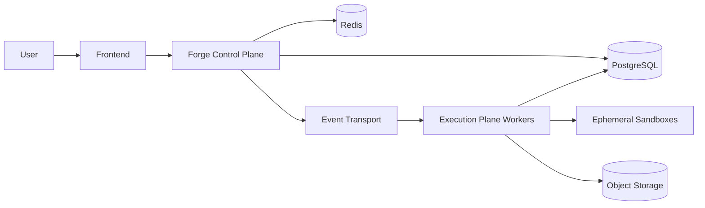
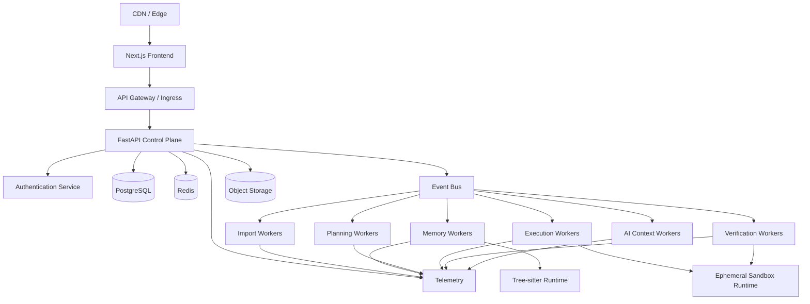

# RFC-008 — Part 1
# Platform Architecture, Environment Model & Infrastructure Foundations

**Status:** Draft for implementation  
**RFC Owner:** Forge Platform Engineering  
**Audience:** Backend engineers, frontend engineers, platform engineers, SRE, security, QA, technical leadership  
**Depends On:** RFC-001 through RFC-007  
**Target Platform:** Cloud-agnostic core with provider-specific deployment profiles  
**Normative Language:** MUST, SHOULD, MAY are used as defined by RFC 2119.

---

## 1. Executive Summary

This RFC defines the infrastructure and deployment architecture required to run
Forge AI as a reliable, secure, observable, and scalable autonomous software
engineering platform.

Forge consists of multiple stateful and stateless subsystems:

- Next.js frontend
- FastAPI control plane
- Repository import workers
- Repository Memory Engine
- Planning Engine
- Execution Engine
- Verification and Self-Repair Engine
- AI Context Engine
- PostgreSQL
- Redis
- object storage
- event transport
- sandbox execution infrastructure
- observability stack

The platform must support both small-team deployments and a future multi-tenant
commercial offering without forcing a complete redesign.

The central architectural principle is:

> Separate the control plane from the execution plane.

The control plane handles user requests, plans, metadata, policy, orchestration,
and state transitions. The execution plane handles isolated repository work,
tool invocation, builds, tests, and repairs.

---

## 2. Goals

RFC-008 establishes:

- production deployment topology
- environment separation
- service boundaries
- infrastructure ownership
- cloud and region strategy
- container and runtime standards
- service discovery and networking
- secrets and configuration management
- CI/CD
- observability
- scaling
- reliability
- backup and disaster recovery
- operational runbooks
- production readiness criteria

---

## 3. Non-Goals

This RFC does not define:

- frontend UX details
- planning algorithms
- repository graph algorithms
- prompt semantics
- enterprise billing
- organization-level governance policy
- plugin marketplace semantics

Those are covered elsewhere or deferred.

---

## 4. Architectural Principles

### 4.1 Control Plane and Execution Plane Separation



The control plane MUST remain available even when execution capacity is
temporarily exhausted.

### 4.2 Stateless Services by Default

Services should be stateless unless state ownership is explicit.

Persistent state belongs in:

- PostgreSQL
- Redis for transient coordination
- object storage
- append-only event records

### 4.3 Immutable Infrastructure

Production infrastructure SHOULD be changed through code and reviewed pull
requests rather than direct console edits.

### 4.4 Replace Rather Than Repair

Instances, containers, and workers should be replaceable. Manual repair of
individual nodes is discouraged.

### 4.5 Explicit Failure Domains

Every component must define:

- what it depends on
- what happens when dependencies fail
- whether it can degrade
- how it recovers
- how operators are alerted

---

## 5. System Topology



---

## 6. Environment Model

Required environments:

- local
- test
- preview
- staging
- production

### 6.1 Local

Purpose:

- individual development
- component debugging
- rapid iteration

Local dependencies may use Docker Compose.

### 6.2 Test

Purpose:

- integration tests
- CI
- deterministic fixtures
- disposable databases

Test environments MUST be isolated per run where practical.

### 6.3 Preview

Purpose:

- pull request validation
- UI review
- API contract testing
- ephemeral feature validation

Preview environments must not access production data.

### 6.4 Staging

Purpose:

- production-like validation
- smoke testing
- migration rehearsal
- release candidate validation

Staging should mirror production architecture closely enough to expose
deployment and configuration problems.

### 6.5 Production

Production requires:

- strict access control
- protected deployment paths
- change audit
- monitored SLOs
- automated backups
- rollback capability
- incident response

---

## 7. Environment Isolation

Each environment MUST have separate:

- database
- Redis instance or namespace
- object storage bucket
- secrets
- event transport
- domains
- observability labels
- encryption boundaries where required

Production credentials must never be reused outside production.

---

## 8. Region Strategy

Initial recommendation:

- one primary region
- one backup region
- globally distributed frontend
- regional API and data plane
- multi-region object replication where economical

Repository execution should occur in the same region as the control plane unless
policy or data residency requires otherwise.

---

## 9. Data Residency

Forge may process private source code.

Infrastructure must support future policies for:

- region-pinned organizations
- no cross-region replication
- customer-controlled retention
- encrypted storage
- execution locality

Data classification should distinguish:

- public metadata
- user profile data
- repository metadata
- repository source
- prompts containing source
- logs
- secrets
- audit records

---

## 10. Service Ownership

Each service must have:

- owning team
- runbook
- dashboards
- alert policy
- deployment pipeline
- dependency map
- on-call escalation path

Example ownership:

| Service | Owner |
|---|---|
| Web | Frontend Platform |
| API | Core Platform |
| Import | Repository Platform |
| Memory | Repository Intelligence |
| Planning | Agent Platform |
| Execution | Runtime Platform |
| Verification | Quality Platform |
| AI Context | Model Platform |

---

## 11. Configuration Model

Configuration sources:

1. code defaults
2. environment configuration
3. secret manager
4. runtime feature flags

Configuration must be typed and validated at startup.

Services MUST fail fast if required configuration is missing or invalid.

---

## 12. Secrets Management

Secrets include:

- database credentials
- Redis credentials
- GitHub OAuth credentials
- AI provider keys
- signing keys
- encryption keys
- webhook secrets

Requirements:

- never stored in source control
- never logged
- encrypted at rest
- least-privilege access
- rotation support
- environment separation
- audited retrieval

---

## 13. Domain and Routing Strategy

Example domains:

```text
app.forge.example
api.forge.example
status.forge.example
assets.forge.example
```

Internal service names should not be exposed publicly.

Ingress routes should terminate TLS and forward identity context only through
trusted headers.

---

## 14. Persistent Storage

### 14.1 PostgreSQL

System of record for:

- users
- organizations
- repositories
- plans
- executions
- verification results
- prompt metadata
- audit records
- provider state

### 14.2 Redis

Used for:

- caching
- distributed locks
- rate limiting
- transient job coordination
- short-lived session data
- pub/sub where appropriate

Redis must not be treated as the sole durable record.

### 14.3 Object Storage

Used for:

- repository snapshots
- context snapshots
- logs
- artifacts
- build outputs
- verification reports
- prompt and response snapshots where policy permits

---

## 15. Event Transport

The event layer must support:

- durable delivery
- retries
- consumer groups
- dead-letter queues
- ordering within aggregate
- observability
- replay

Implementation may use:

- Kafka
- NATS JetStream
- cloud-managed queues
- Redis Streams for initial deployments

The semantic contract matters more than the provider.

---

## 16. Infrastructure as Code

Infrastructure should be managed with:

- Terraform or OpenTofu
- Helm or Kustomize
- GitOps where appropriate
- environment overlays
- policy checks

Changes require:

- review
- plan output
- security checks
- drift detection
- rollback path

---

## 17. Resource Tagging

All cloud resources should include:

- service
- environment
- owner
- cost center
- data classification
- region
- managed-by
- repository

---

## 18. Naming Convention

Example:

```text
forge-prod-api
forge-prod-postgres
forge-staging-redis
forge-preview-pr-184
```

Names should be deterministic and environment-scoped.

---

## 19. Dependency Matrix

| Component | Hard Dependency | Degraded Mode |
|---|---|---|
| Frontend | API | read-only cached shell |
| API | PostgreSQL | unavailable |
| API | Redis | reduced caching and coordination |
| Execution | event bus | queued until recovery |
| Verification | sandbox runtime | blocked |
| AI Context | provider | fallback provider |
| Memory | parser runtime | partial indexing |

---

## 20. Capacity Classes

Forge should define deployment classes:

### Developer

- single-node database
- shared workers
- low concurrency
- minimal HA

### Team

- managed database
- replicated Redis
- autoscaled workers
- standard observability

### Production SaaS

- HA control plane
- multi-AZ database
- isolated execution pools
- advanced observability
- multi-region disaster recovery

---

## 21. Baseline Performance Objectives

- API p95 under normal load: <300ms excluding long-running jobs
- job enqueue latency p95: <100ms
- event propagation p95: <500ms
- worker startup p95: <10s
- sandbox startup p95: <20s
- frontend availability: 99.9%
- control plane availability: 99.9%
- durable event loss: 0 tolerated

---

## 22. Acceptance Criteria

Part 1 is complete when:

- environments are separated
- control and execution planes are defined
- service ownership is assigned
- data storage responsibilities are explicit
- event transport requirements are documented
- secrets are externalized
- infrastructure is code-managed
- deployment classes are defined
- region and data residency strategy are documented
- baseline SLOs are approved

---

## 23. Implementation Checklist

- [ ] local Compose stack
- [ ] environment naming standard
- [ ] infrastructure repository
- [ ] secrets manager integration
- [ ] environment config validation
- [ ] service ownership registry
- [ ] resource tagging policy
- [ ] event transport selected
- [ ] production topology approved
- [ ] data classification completed

---

**End of RFC-008 Part 1**
