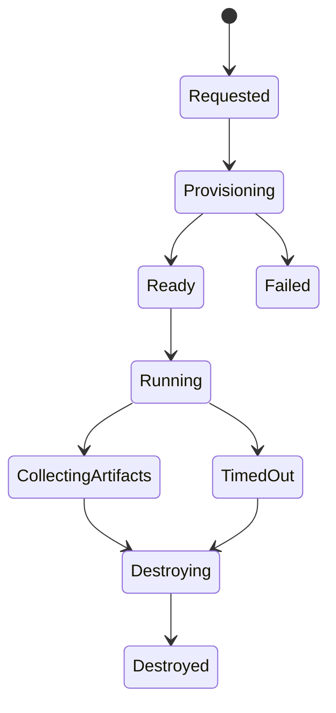

# RFC-008 — Part 2
# Containers, Orchestration, Sandboxing, Service Networking & Runtime Isolation

**Status:** Draft for implementation  
**Audience:** Platform engineering, runtime engineering, security, SRE  
**Depends On:** RFC-008 Part 1

---

## 1. Executive Summary

This document defines how Forge services and repository workloads are packaged,
scheduled, isolated, networked, and terminated.

The most important distinction is between:

- trusted platform services
- untrusted repository workloads

Repository code must never execute with the same privileges, network access, or
filesystem access as control-plane services.

---

## 2. Container Standards

Every service image MUST:

- use a minimal base image
- run as non-root
- pin runtime versions
- expose a health endpoint
- include build metadata
- avoid embedded secrets
- support graceful shutdown
- be scanned before release

---

## 3. Image Layers

Recommended pattern:

1. dependency base
2. build layer
3. runtime layer
4. metadata labels

Production images should not contain:

- package manager caches
- build toolchains unless required
- test fixtures
- source maps unless protected
- development credentials

---

## 4. Container Metadata

Required labels:

- source revision
- build timestamp
- service name
- version
- license metadata
- SBOM reference

---

## 5. Orchestration Platform

Recommended:

- Kubernetes for backend and workers
- Vercel or equivalent for frontend
- managed PostgreSQL
- managed Redis
- managed object storage
- managed event transport where possible

Kubernetes is not required for local development.

---

## 6. Namespace Model

Recommended namespaces:

```text
forge-system
forge-control
forge-workers
forge-sandboxes
forge-observability
forge-staging
```

Production and staging should use separate clusters or strong isolation.

---

## 7. Deployment Types

### Control Plane

Use Deployments for:

- API
- auth
- prompt registry
- orchestration services

### Workers

Use Deployments or autoscaled job workers for:

- import
- memory
- planning
- execution coordination
- verification
- repair

### Repository Sandboxes

Use short-lived Jobs, pods, microVMs, or hardened containers.

---

## 8. Sandbox Threat Model

Repository code may:

- consume excessive CPU
- consume memory
- fork processes
- access the network
- scan metadata endpoints
- read mounted secrets
- escape the container
- exfiltrate source code
- hang indefinitely

Sandbox design must assume repository code is hostile.

---

## 9. Sandbox Isolation Levels

### Level 1 — Hardened Container

Suitable for trusted internal code.

Controls:

- non-root
- read-only root filesystem
- seccomp
- AppArmor or SELinux
- dropped capabilities
- resource limits
- no host mounts
- restricted network

### Level 2 — gVisor or Equivalent

Suitable for standard multi-tenant workloads.

### Level 3 — Firecracker MicroVM

Suitable for high-risk or premium isolation.

Forge should support multiple runtime classes selected by policy.

---

## 10. Sandbox Lifecycle



---

## 11. Sandbox Filesystem

Recommended layout:

```text
/workspace/repository
/workspace/output
/workspace/cache
/workspace/tools
```

Rules:

- repository checkout is isolated
- output directory is explicit
- secrets are injected minimally
- host filesystem is never mounted
- filesystem is destroyed after completion
- artifacts are uploaded before teardown

---

## 12. Resource Limits

Each sandbox requires:

- CPU request and limit
- memory request and limit
- disk quota
- process count limit
- execution timeout
- output size limit
- network quota where feasible

---

## 13. Network Policy

Default deny.

Allow only:

- required package registries
- approved source providers
- required verification endpoints
- object storage via controlled path
- internal control callback if required

Block:

- metadata service
- private cluster networks
- database
- Redis
- secret manager
- control-plane internals
- arbitrary outbound traffic by default

---

## 14. Dependency Installation

Dependency installation is a high-risk operation.

Controls:

- allowlisted registries
- lockfile enforcement
- package integrity verification
- network timeout
- installation cache
- no global installation
- dependency diff inspection
- optional approval gate

---

## 15. Service Networking

Internal service communication should use:

- cluster-local DNS
- mutual TLS where available
- service accounts
- policy-based authorization
- retries with budgets
- request timeouts

---

## 16. Ingress

Public ingress is limited to:

- frontend
- API gateway
- webhook endpoints

Workers and databases must not have public ingress.

---

## 17. Egress

Egress should be centrally controlled.

Provider egress may include:

- GitHub
- Anthropic
- OpenAI
- Google
- package registries
- object storage

Egress destinations should be observable.

---

## 18. Health Checks

### Liveness

Answers:

> Is the process irrecoverably unhealthy?

### Readiness

Answers:

> Can this instance safely receive traffic?

### Startup

Used for slow-starting services.

Do not use dependency failures as liveness failures unless restart is useful.

---

## 19. Graceful Shutdown

Services must:

1. stop receiving new work
2. finish or checkpoint current work
3. acknowledge or release jobs safely
4. flush telemetry
5. close connections
6. exit within configured timeout

---

## 20. Worker Scheduling

Queues may be separated by:

- workload type
- repository size
- customer tier
- risk level
- runtime class
- region

Example queues:

```text
import-small
import-large
memory-cpu
planning-ai
execution-standard
execution-isolated
verification-heavy
```

---

## 21. Autoscaling

Signals:

- queue depth
- queue age
- CPU
- memory
- active sandboxes
- provider latency
- event lag

Scale-to-zero may be used for infrequent worker types but not for critical
control-plane services.

---

## 22. Pod Disruption

Critical services require:

- disruption budgets
- multiple replicas
- anti-affinity
- zone spread
- controlled rolling updates

---

## 23. Scheduling Constraints

Use:

- node pools
- taints and tolerations
- priority classes
- topology spread
- GPU pool only if needed

Sandbox workloads should not co-locate with databases or control-plane nodes.

---

## 24. Artifact Collection

Before sandbox deletion, collect:

- patch
- logs
- test reports
- build output metadata
- execution manifest
- checksums
- failure diagnostics

Artifacts must be content-addressed where practical.

---

## 25. Caching

Caches may include:

- package manager cache
- parser cache
- repository mirror cache
- build cache

Cache keys must include:

- repository revision
- runtime version
- lockfile checksum
- toolchain version
- architecture

Caches are untrusted inputs and should be validated.

---

## 26. Runtime Security Controls

- seccomp profile
- capability drop
- read-only root
- no privilege escalation
- rootless execution
- PID limit
- syscall monitoring
- runtime anomaly detection where available

---

## 27. Observability for Sandboxes

Capture:

- startup latency
- queue wait
- CPU
- memory
- disk
- network
- process count
- exit code
- timeout
- artifact upload status

---

## 28. Failure Handling

### Provisioning Failure

- retry on different node
- classify infrastructure cause
- preserve request
- alert if systemic

### Runtime Failure

- capture logs
- preserve diagnostics
- distinguish user code from platform failure
- destroy sandbox

### Cleanup Failure

- quarantine resource
- alert
- enforce TTL controller

---

## 29. Acceptance Criteria

- platform services run as non-root
- sandboxes are isolated from control plane
- default-deny networking is enforced
- resource limits exist
- runtime classes are selectable
- lifecycle is observable
- artifacts survive sandbox teardown
- cleanup is automatic
- autoscaling uses queue-aware signals
- disruption controls are defined

---

## 30. Implementation Checklist

- [ ] base images hardened
- [ ] image scanning enabled
- [ ] sandbox runtime selected
- [ ] network policies applied
- [ ] runtime classes defined
- [ ] queue segmentation implemented
- [ ] autoscaling configured
- [ ] artifact collection tested
- [ ] TTL cleanup controller enabled
- [ ] sandbox escape testing scheduled

---

**End of RFC-008 Part 2**
