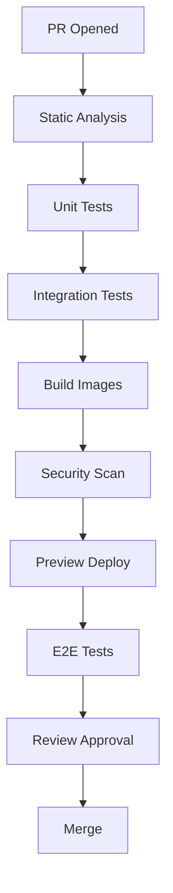

# RFC-008 — Part 3
# CI/CD, Release Engineering, Database Migrations & Software Supply Chain

**Status:** Draft for implementation  
**Audience:** Platform engineering, application teams, QA, security, SRE  
**Depends On:** RFC-008 Parts 1–2

---

## 1. Executive Summary

This document defines how Forge code and infrastructure move from commit to
production.

The release system must optimize for:

- repeatability
- traceability
- fast feedback
- safe rollback
- compatibility
- supply-chain integrity
- minimal manual production access

---

## 2. Repository Strategy

Recommended repositories or monorepo boundaries:

```text
forge/
  apps/web
  apps/api
  services/import
  services/memory
  services/planning
  services/execution
  services/verification
  services/ai-context
  packages/*
  infrastructure/*
```

A monorepo is acceptable if ownership and build boundaries are enforced.

---

## 3. Branching Model

Recommended:

- trunk-based development
- short-lived branches
- protected main branch
- required reviews
- required status checks
- no direct production commits

---

## 4. Pull Request Pipeline



---

## 5. Required CI Checks

- formatting
- lint
- type checking
- unit tests
- integration tests
- contract tests
- schema validation
- dependency scanning
- secret scanning
- container scanning
- infrastructure plan
- policy checks
- build
- frontend bundle budgets
- migration validation

---

## 6. Build Reproducibility

Builds should use:

- pinned toolchains
- lockfiles
- deterministic dependency resolution
- immutable base images
- controlled build network
- build cache with integrity checks

---

## 7. Artifact Identity

Each build artifact must include:

- commit SHA
- semantic or release version
- build ID
- build timestamp
- source repository
- SBOM reference
- provenance attestation

---

## 8. Container Registry

Requirements:

- private registry
- immutable production tags
- vulnerability scanning
- retention policy
- promotion between environments
- signed images

Avoid deploying mutable `latest` tags.

---

## 9. Software Bill of Materials

Every release should generate an SBOM including:

- packages
- versions
- licenses
- hashes
- source

SBOMs should be retained with release metadata.

---

## 10. Provenance and Signing

Recommended controls:

- signed commits for privileged changes
- signed images
- provenance attestations
- verified deployment source
- protected CI identities

---

## 11. Preview Environments

Preview environments should be created per pull request when feasible.

Capabilities:

- frontend preview
- isolated API
- temporary database
- seeded test data
- mock provider mode
- restricted external access

Preview resources must expire automatically.

---

## 12. Staging Promotion

Staging deploys from immutable artifacts already built in CI.

Do not rebuild different artifacts for production.

---

## 13. Production Deployment

Recommended strategy by service:

- rolling deployment for stateless low-risk services
- canary for critical API and workers
- blue/green for major incompatible changes
- controlled job versioning for long-running workers

---

## 14. Canary Strategy

Canary metrics:

- error rate
- latency
- saturation
- queue lag
- job success
- event delivery
- database errors
- client crashes

Promotion should be automated when thresholds pass.

---

## 15. Feature Flags

Use feature flags for:

- gradual rollout
- emergency disable
- organization targeting
- migration sequencing
- experimental UI

Flags must have:

- owner
- expiration date
- default
- audit history

---

## 16. Database Migration Strategy

Migrations must be:

- versioned
- reviewed
- tested
- backward compatible during rollout
- observable
- reversible where possible

### 16.1 Expand and Contract

1. add new schema
2. deploy compatible code
3. backfill
4. switch reads/writes
5. remove old schema later

---

## 17. Migration Safety

Before production:

- validate lock impact
- estimate runtime
- test on realistic data
- confirm backup
- define abort criteria
- define rollback

Large migrations should use online methods.

---

## 18. Event Schema Evolution

Events are public contracts between services.

Rules:

- additive changes preferred
- old consumers remain functional
- schema version included
- incompatible changes require new event type
- replay compatibility tested

---

## 19. API Compatibility

API versioning options:

- path version
- header version
- capability negotiation

Frontend and backend deployments must tolerate brief version skew.

---

## 20. Worker Versioning

Long-running jobs may begin under one version and complete under another.

Every job records:

- worker version
- schema version
- prompt version
- toolchain version
- runtime class

---

## 21. Rollback

Rollback categories:

- application rollback
- configuration rollback
- feature flag disable
- infrastructure rollback
- database mitigation

Database rollback may not always be automatic. Forward-fix plans are required.

---

## 22. Deployment Freeze

Production freeze may be required during:

- severe incidents
- migrations
- major provider outages
- security events
- high-risk customer events

---

## 23. Release Metadata

Every release should expose:

- version
- commit
- build
- deployment timestamp
- environment
- migration version
- feature flag snapshot

---

## 24. CI Security

CI runners must:

- use least privilege
- isolate untrusted PRs
- protect secrets
- avoid exposing production credentials
- expire tokens
- restrict artifact upload
- prevent fork exfiltration

---

## 25. Dependency Updates

Automated update tools may open PRs.

Policy:

- patch updates automated
- minor updates reviewed
- major updates require migration plan
- security updates prioritized
- abandoned packages replaced

---

## 26. Release Gates

Production deployment requires:

- approved change
- passing tests
- signed artifact
- vulnerability threshold met
- migration approval
- SLO baseline healthy
- rollback path confirmed

---

## 27. Deployment Audit

Record:

- who approved
- what artifact
- target environment
- config version
- start and end
- result
- rollback if any

---

## 28. Performance Regression Gates

CI should fail or warn when:

- API benchmark regresses
- bundle size exceeds budget
- worker throughput falls
- sandbox startup worsens
- memory usage exceeds threshold

---

## 29. Acceptance Criteria

- all artifacts are traceable to source
- production artifacts are immutable
- builds are reproducible
- previews are isolated
- staging uses production-equivalent artifacts
- migrations are safe
- canary analysis exists
- rollback is tested
- SBOM is generated
- CI identities are protected

---

## 30. Implementation Checklist

- [ ] protected main branch
- [ ] required checks
- [ ] preview environments
- [ ] signed containers
- [ ] SBOM generation
- [ ] provenance attestation
- [ ] canary controller
- [ ] migration rehearsal
- [ ] release metadata endpoint
- [ ] rollback drill

---

**End of RFC-008 Part 3**
