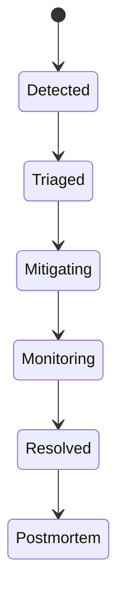

# RFC-008 — Part 5
# Security, Backup, Disaster Recovery, Cost Governance, Runbooks & Production Readiness

**Status:** Draft for implementation  
**Audience:** Security, platform engineering, SRE, engineering leadership, compliance  
**Depends On:** RFC-008 Parts 1–4

---

## 1. Executive Summary

This document completes RFC-008.

It defines the platform-level security, backup, disaster recovery, cost control,
incident response, and final production readiness requirements for Forge.

Because Forge processes source code and executes repository workloads, platform
security must assume:

- source code is sensitive
- repository code may be hostile
- external providers may fail
- operators may make mistakes
- infrastructure may be compromised
- data restoration may be required

---

## 2. Security Model

Security goals:

- confidentiality
- integrity
- availability
- isolation
- traceability
- recoverability

---

## 3. Identity and Access Management

Human access must use:

- centralized identity provider
- MFA
- role-based access
- short-lived sessions
- audit logging
- periodic access review

Service access must use:

- workload identity
- short-lived credentials
- least privilege
- no shared static credentials

---

## 4. Privileged Access

Production administrative access should be:

- rare
- time-limited
- approved
- logged
- tied to a person
- reviewed after use

Break-glass access requires a documented process.

---

## 5. Encryption

### In Transit

- TLS for public traffic
- TLS for internal traffic where supported
- certificate rotation

### At Rest

- database encryption
- object storage encryption
- backup encryption
- secret manager encryption

For future enterprise tiers, customer-managed keys may be supported.

---

## 6. Key Management

Keys must have:

- owner
- purpose
- rotation period
- access policy
- revocation procedure
- backup or recovery method where appropriate

---

## 7. Network Security

- private databases
- private Redis
- restricted event transport
- default-deny sandbox networking
- controlled ingress
- controlled egress
- web application firewall where appropriate
- DDoS protection at edge

---

## 8. Vulnerability Management

Sources:

- dependency scanning
- container scanning
- infrastructure scanning
- code scanning
- penetration testing
- sandbox escape testing

Severity response targets should be documented.

---

## 9. Secret Rotation

Rotation plan for:

- database credentials
- provider keys
- OAuth secrets
- signing keys
- webhook secrets

Rotation should avoid downtime.

---

## 10. Audit Logging

Audit events include:

- login
- permission change
- provider configuration
- repository connection
- execution approval
- production deployment
- secret access
- backup restore
- break-glass use

Audit storage must be append-only and access-controlled.

---

## 11. Backup Strategy

### PostgreSQL

- continuous point-in-time recovery
- daily snapshots
- cross-region copy
- restore testing

### Object Storage

- versioning
- lifecycle policy
- replication where needed
- deletion protection for critical buckets

### Redis

Redis is generally reconstructable, but snapshots may be used where operationally
valuable.

---

## 12. Recovery Objectives

Suggested initial targets:

| System | RPO | RTO |
|---|---:|---:|
| PostgreSQL | <5 minutes | <1 hour |
| Object storage metadata | <15 minutes | <2 hours |
| Control plane | near-zero | <30 minutes |
| Execution workers | none required | <30 minutes |
| Observability | <1 hour | <4 hours |

---

## 13. Disaster Recovery Scenarios

- database corruption
- region outage
- accidental deletion
- object storage failure
- secret compromise
- cluster failure
- event transport loss
- malicious deployment

---

## 14. Region Failure

Recovery sequence:

1. declare incident
2. freeze writes if consistency uncertain
3. promote database replica
4. restore control plane
5. validate event transport
6. restore object access
7. reconcile active executions
8. reopen traffic gradually

---

## 15. Restore Testing

Backups are not valid until restored successfully.

Quarterly or more frequent tests should verify:

- database restore
- object restore
- application startup
- schema compatibility
- authentication
- critical workflow
- audit integrity

---

## 16. Data Retention

Retention categories:

- source snapshots
- execution logs
- prompts
- model responses
- artifacts
- audit events
- metrics
- traces

Retention should be configurable by environment and organization policy.

---

## 17. Secure Deletion

Deletion workflows must cover:

- database rows
- object storage
- caches
- backups according to policy
- derived artifacts
- analytics identifiers

---

## 18. Cost Architecture

Primary cost drivers:

- AI tokens
- sandbox compute
- verification compute
- database
- storage
- event transport
- observability
- network egress

---

## 19. Cost Attribution

Track cost by:

- organization
- repository
- execution
- provider
- model
- worker class
- environment

---

## 20. Budgets and Alerts

Budget alerts for:

- daily AI spend
- sandbox compute
- storage growth
- preview environments
- data egress
- logging volume

---

## 21. Cost Controls

- concurrency limits
- token budgets
- model routing
- cache reuse
- preview TTL
- artifact lifecycle
- log sampling
- right-sized instances
- spot capacity for interruptible jobs

---

## 22. Incident Response

Incident roles:

- incident commander
- operations lead
- communications lead
- subject matter experts
- scribe

---

## 23. Incident Lifecycle

---

## 24. Communication

For significant incidents:

- internal status update
- external status page
- affected user notification
- recovery update
- post-incident summary

---

## 25. Postmortems

Postmortems should be blameless and include:

- impact
- timeline
- detection
- root cause
- contributing factors
- mitigation
- corrective actions
- owners
- deadlines

---

## 26. Operational Runbooks

Required runbooks:

- database failover
- Redis outage
- event bus outage
- worker backlog
- sandbox provisioning failure
- provider outage
- GitHub outage
- object storage failure
- authentication outage
- compromised credential
- failed deployment
- region failover

---

## 27. Example Runbook — Worker Backlog

1. identify affected queue
2. inspect oldest job age
3. inspect worker health
4. scale worker pool
5. verify downstream dependencies
6. pause low-priority jobs
7. notify users if delay is significant
8. review capacity after recovery

---

## 28. Example Runbook — Provider Outage

1. mark provider degraded
2. activate fallback routing
3. disable provider-specific features if needed
4. monitor fallback cost and limits
5. notify affected users
6. restore after health checks pass
7. reconcile failed requests

---

## 29. Production Readiness Review

Before launch, review:

- architecture
- security
- capacity
- observability
- backups
- DR
- deployment
- rollback
- support
- cost

---

## 30. Launch Gates

- no critical security findings
- backups verified
- restore tested
- SLO dashboards active
- alerts routed
- rollback tested
- migration tested
- sandbox isolation tested
- cost alerts active
- incident roles assigned
- runbooks available

---

## 31. RFC-008 Definition of Done

RFC-008 is complete when:

- infrastructure is defined as code
- environments are isolated
- control and execution planes are separated
- workloads are containerized
- untrusted code is sandboxed
- networking is least-privilege
- CI/CD is automated
- artifacts are signed and traceable
- database migrations are safe
- observability is complete
- SLOs and error budgets exist
- autoscaling and backpressure are implemented
- backups and restore tests pass
- DR targets are approved
- security controls are validated
- cost attribution exists
- runbooks are operational
- production readiness review passes

---

## 32. Recommended Implementation Sequence

### Phase 1 — Local and Staging Foundations

- Compose
- managed database
- managed Redis
- object storage
- event transport
- basic observability

### Phase 2 — Container Platform

- Kubernetes
- workers
- sandboxes
- network policy
- autoscaling

### Phase 3 — Delivery

- CI/CD
- preview
- staging
- signed artifacts
- canary

### Phase 4 — Reliability

- SLOs
- alerts
- capacity
- chaos
- DR

### Phase 5 — Security and Cost

- key rotation
- access reviews
- cost attribution
- launch review

---

## 33. RFC-008 Completion Summary

RFC-008 defines the operational foundation for Forge AI.

The platform is designed to:

- preserve control-plane availability
- safely execute untrusted code
- scale worker fleets independently
- deploy immutably
- recover from failure
- provide end-to-end observability
- protect source code and credentials
- control cost
- support future multi-tenant growth

The next RFC should define Forge's extension model, plugin SDK, tool runtime,
capability permissions, and external integration architecture.

---

**END OF RFC-008**
