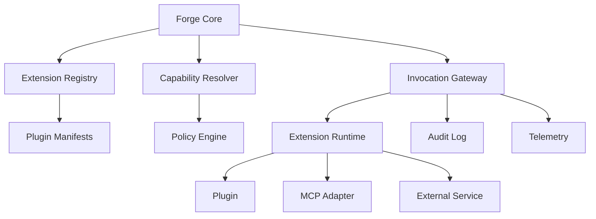
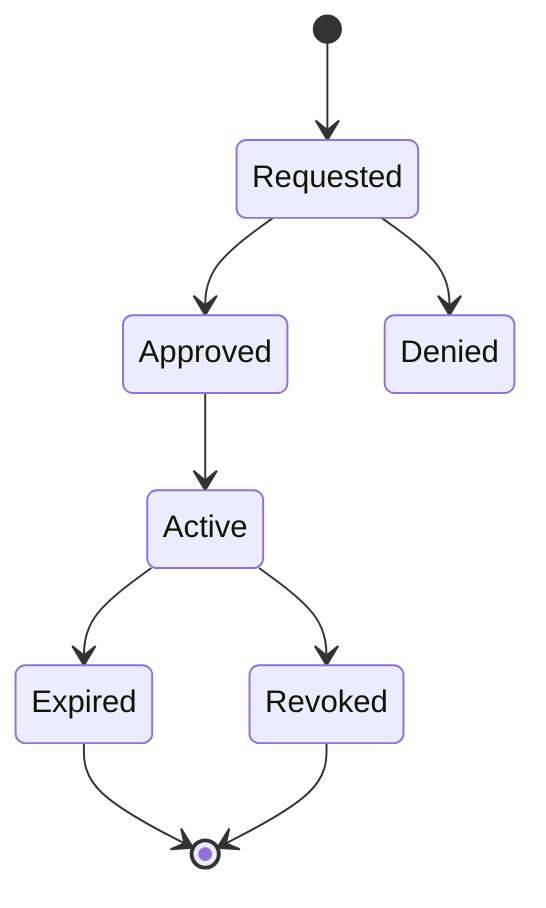

# RFC-009 — Part 1
# Extension Architecture, Plugin SDK & Capability Model

**Status:** Draft for implementation  
**RFC Owner:** Forge Extensibility Platform  
**Audience:** Platform engineers, SDK engineers, security engineers, plugin authors, product teams  
**Depends On:** RFC-001 through RFC-008  
**Normative Language:** MUST, SHOULD, MAY are used as defined by RFC 2119.

---

## 1. Executive Summary

This RFC defines Forge AI's extensibility architecture.

Forge must support external and internal extensions without allowing plugins to
bypass security boundaries, corrupt repository state, access unauthorized data,
or create provider-specific coupling inside the core platform.

The extension platform enables:

- tools
- repository analyzers
- verification checks
- planning strategies
- context enrichers
- output renderers
- workflow actions
- external integrations
- MCP servers
- agent skills
- organization-specific policies

The extension model is built around explicit capabilities, versioned contracts,
sandboxed execution, deterministic inputs, structured outputs, and auditable
permission grants.

The core principle is:

> Plugins request capabilities. Forge grants capabilities. Plugins never infer
> authority from their environment.

---

## 2. Goals

RFC-009 establishes:

- extension boundaries
- SDK architecture
- plugin manifests
- capability permissions
- lifecycle management
- versioning and compatibility
- runtime isolation
- tool invocation contracts
- MCP integration
- registry and marketplace behavior
- security review
- plugin testing
- observability
- production operations

---

## 3. Non-Goals

This RFC does not define:

- end-user billing
- commercial revenue sharing
- legal marketplace terms
- complete enterprise governance
- unrestricted arbitrary code execution
- direct database access for extensions

---

## 4. Extension Types

Forge recognizes the following extension types.

### 4.1 Tool Extension

Performs a bounded action.

Examples:

- search documentation
- query an issue tracker
- run a static analyzer
- create a ticket
- format a file
- inspect cloud configuration

### 4.2 Context Provider

Adds structured context to the AI Context Engine.

Examples:

- architecture documentation
- ticket metadata
- service ownership
- API specifications
- deployment history

### 4.3 Analyzer

Inspects repository or execution artifacts.

Examples:

- dependency risk
- code ownership
- security rules
- framework-specific analysis

### 4.4 Verifier

Runs a validation step.

Examples:

- lint
- security scan
- policy check
- contract test
- compliance validation

### 4.5 Planner Strategy

Adds planning heuristics or domain-specific task decomposition.

### 4.6 Renderer

Adds UI presentation for structured extension output.

### 4.7 Integration

Connects Forge to an external system.

Examples:

- GitHub
- GitLab
- Jira
- Linear
- Slack
- cloud providers
- observability systems

### 4.8 Policy Extension

Adds organization-specific rules.

---

## 5. High-Level Architecture



---

## 6. Design Principles

### 6.1 Explicit Contracts

Every extension declares:

- identity
- version
- extension types
- inputs
- outputs
- capabilities
- runtime requirements
- compatibility range

### 6.2 Least Privilege

Plugins receive only the minimum capabilities required for one invocation.

### 6.3 Structured Inputs and Outputs

Free-form text may exist inside payload fields, but the invocation envelope and
result must be schema-validated.

### 6.4 No Ambient Authority

Plugins must not inherit:

- host filesystem access
- network access
- credentials
- user identity
- repository access

### 6.5 Reproducibility

An invocation should record enough metadata to reproduce or explain it.

### 6.6 Fail Closed

Unknown permissions, schemas, or plugin states result in rejection.

---

## 7. Plugin Manifest

Example:

```yaml
apiVersion: forge.dev/v1
kind: Plugin
metadata:
  id: com.example.security-checker
  name: Example Security Checker
  version: 1.4.2
  publisher: example
spec:
  sdkVersion: "^1.0.0"
  runtime:
    type: container
    entrypoint: ["/app/plugin"]
    timeoutSeconds: 120
  extensions:
    - type: verifier
      id: security.scan
      inputSchema: schemas/security-scan-input.json
      outputSchema: schemas/security-scan-output.json
  capabilities:
    required:
      - repository.files.read
      - execution.artifacts.write
    optional:
      - network.egress
  compatibility:
    forge: ">=1.0.0 <2.0.0"
```

---

## 8. Manifest Validation

Validation layers:

1. syntax
2. schema
3. semantic rules
4. capability review
5. compatibility
6. signature
7. publisher trust
8. runtime policy

Published manifests are immutable per version.

---

## 9. Plugin Identity

A plugin identity consists of:

- publisher namespace
- plugin name
- version
- package digest
- signing identity

Example:

```text
com.acme.cloud-policy@2.3.1
```

The package digest is the final identity used at runtime.

---

## 10. Capability Model

Capabilities are namespaced strings.

Examples:

```text
repository.metadata.read
repository.files.read
repository.files.write
repository.graph.read
execution.create
execution.artifacts.read
execution.artifacts.write
verification.register
context.contribute
network.egress
secrets.use
ui.render
external.github.read
external.github.write
```

---

## 11. Capability Classes

### Read Capabilities

Allow access to defined data.

### Write Capabilities

Allow mutation through Forge-controlled APIs.

### Execution Capabilities

Allow compute or tool execution.

### External Capabilities

Allow interaction with third-party services.

### Privileged Capabilities

Examples:

- secrets.use
- repository.files.write
- production.deploy
- external.github.write

Privileged capabilities require enhanced review.

---

## 12. Capability Constraints

Capabilities may include constraints:

```json
{
  "capability": "repository.files.read",
  "constraints": {
    "paths": ["src/**", "tests/**"],
    "maxBytes": 10000000,
    "repositoryId": "repo_01..."
  }
}
```

Other constraints:

- time window
- invocation count
- allowed domains
- branch
- file patterns
- organization
- user
- environment

---

## 13. Permission Grant Lifecycle



Grants may be:

- one invocation
- one session
- one repository
- one organization
- time-limited
- permanently approved by admin policy

---

## 14. SDK Layers

The SDK should include:

- manifest types
- input/output schemas
- invocation server
- capability client
- logging
- tracing
- error model
- test harness
- local runner
- packaging tools
- publishing tools

---

## 15. SDK Language Support

Initial recommendation:

- TypeScript
- Python

Future:

- Go
- Rust
- Java

All SDKs must implement the same wire protocol.

---

## 16. Extension Interface

Conceptual interface:

```ts
interface ForgeExtension<I, O> {
  metadata(): ExtensionMetadata;
  validate(input: I, context: ValidationContext): Promise<void>;
  invoke(input: I, context: InvocationContext): Promise<O>;
}
```

The context exposes capability-bound clients rather than raw credentials.

---

## 17. Invocation Context

```ts
type InvocationContext = {
  invocationId: string;
  pluginId: string;
  pluginVersion: string;
  organizationId: string;
  repositoryId?: string;
  executionId?: string;
  deadline: string;
  capabilities: GrantedCapability[];
  clients: ForgeCapabilityClients;
  logger: StructuredLogger;
  tracer: Tracer;
};
```

---

## 18. Capability Clients

Examples:

```ts
context.clients.repository.readFile(path)
context.clients.repository.listSymbols(query)
context.clients.artifacts.write(name, bytes)
context.clients.external.github.createComment(...)
```

The SDK must not expose bearer tokens directly.

---

## 19. Output Contract

Every extension returns:

- status
- structured data
- diagnostics
- artifacts
- warnings
- metrics
- optional user-facing summary

Example:

```json
{
  "status": "completed",
  "data": {
    "findings": []
  },
  "warnings": [],
  "artifacts": [],
  "metrics": {
    "files_scanned": 128
  }
}
```

---

## 20. Error Contract

Canonical errors:

- INVALID_INPUT
- CAPABILITY_DENIED
- TIMEOUT
- RATE_LIMITED
- DEPENDENCY_UNAVAILABLE
- EXECUTION_FAILED
- OUTPUT_INVALID
- PLUGIN_BUG
- PLATFORM_ERROR

Errors include retryability.

---

## 21. Determinism

Extensions should declare determinism:

- deterministic
- conditionally deterministic
- non-deterministic

Deterministic extensions should receive controlled:

- time
- random seed
- network
- input snapshots
- environment

---

## 22. Plugin Configuration

Configuration is separated from secrets.

Configuration may be scoped to:

- installation
- organization
- repository
- invocation

Every configuration field must define:

- type
- default
- validation
- sensitivity
- mutability

---

## 23. Secrets

Plugins reference secret handles.

Example:

```text
secret://organization/github-app-token
```

The runtime injects capability-limited access or performs brokered calls.

Raw secret exposure should be avoided.

---

## 24. Installation

Installation steps:

1. resolve package
2. verify signature
3. validate manifest
4. resolve capabilities
5. review permissions
6. create installation
7. store configuration
8. run health check
9. activate

---

## 25. Installation States

- pending
- active
- disabled
- degraded
- suspended
- incompatible
- uninstalled

---

## 26. Compatibility

Compatibility dimensions:

- Forge platform version
- SDK protocol version
- extension type version
- runtime architecture
- operating system
- schema versions

Compatibility is evaluated before activation.

---

## 27. Acceptance Criteria

Part 1 is complete when:

- extension types are defined
- manifests are versioned
- capabilities are explicit
- grants support constraints
- SDK interfaces exist
- plugins receive brokered clients
- inputs and outputs are validated
- installation lifecycle is implemented
- signatures are checked
- compatibility is enforced

---

## 28. Implementation Checklist

- [ ] manifest schema
- [ ] capability registry
- [ ] grant service
- [ ] TypeScript SDK
- [ ] Python SDK
- [ ] local runner
- [ ] installation service
- [ ] schema validator
- [ ] signing verifier
- [ ] example plugins

---

**End of RFC-009 Part 1**
