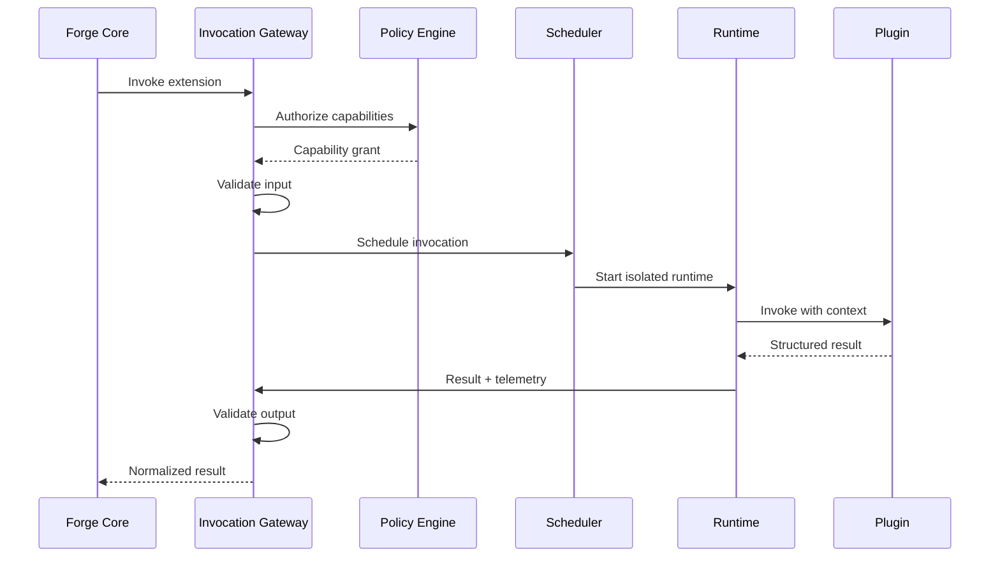
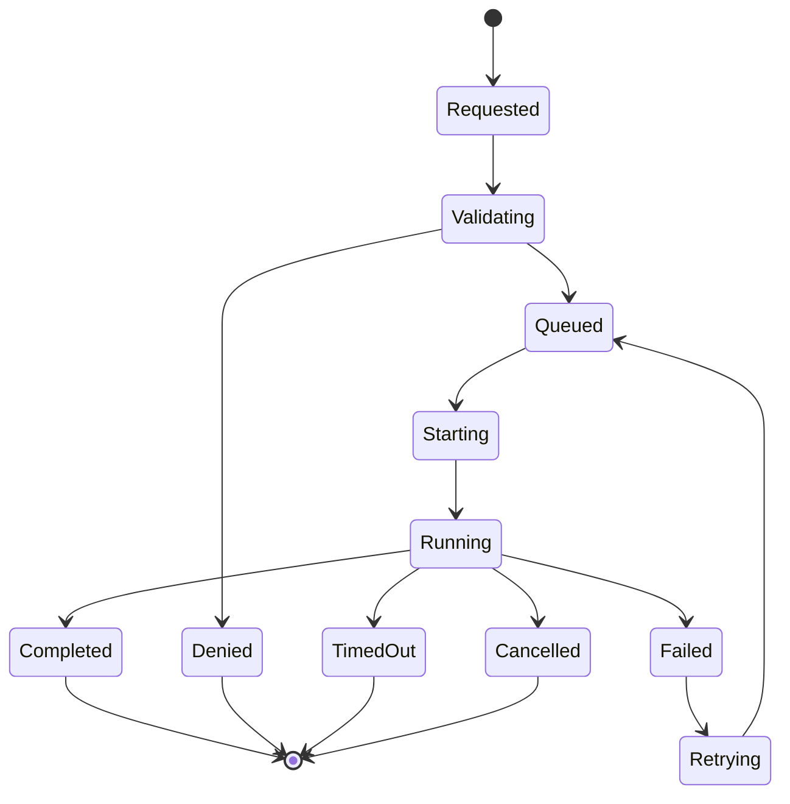

# RFC-009 — Part 2
# Tool Runtime, Invocation Gateway, Scheduling & Sandboxed Execution

**Status:** Draft for implementation  
**Audience:** Runtime engineers, platform engineers, security engineers, SDK engineers  
**Depends On:** RFC-009 Part 1

---

## 1. Executive Summary

This document defines how Forge invokes extension tools.

The Tool Runtime is the controlled bridge between Forge and extension code. It
is responsible for:

- authorization
- input validation
- scheduling
- isolation
- capability brokering
- timeout enforcement
- retries
- output validation
- artifact collection
- auditing
- telemetry

The Tool Runtime must treat all plugins as untrusted unless explicitly marked as
first-party trusted code.

---

## 2. Runtime Architecture



---

## 3. Runtime Classes

### In-Process

Allowed only for audited first-party extensions.

### Isolated Process

Useful for trusted internal extensions requiring language isolation.

### Container

Default for third-party plugins.

### MicroVM

Used for high-risk plugins or privileged workloads.

### Remote Endpoint

Used when the plugin runs outside Forge infrastructure.

### MCP Server

Adapted through the MCP gateway.

---

## 4. Runtime Selection

Inputs:

- trust level
- requested capabilities
- plugin type
- resource requirements
- network needs
- organization policy
- data classification

---

## 5. Invocation Envelope

```json
{
  "protocol_version": "1.0",
  "invocation_id": "inv_01...",
  "extension": {
    "plugin_id": "com.example.security",
    "plugin_version": "1.2.0",
    "extension_id": "security.scan"
  },
  "scope": {
    "organization_id": "org_01...",
    "repository_id": "repo_01...",
    "execution_id": "run_01..."
  },
  "deadline": "2026-07-20T10:00:00Z",
  "capability_token": "opaque-reference",
  "input": {}
}
```

---

## 6. Invocation State Machine



---

## 7. Authorization

Authorization occurs before scheduling and again at capability use.

This prevents:

- stale grants
- revoked permissions
- confused deputy attacks
- runtime tampering

---

## 8. Capability Tokens

Tokens should be:

- short-lived
- invocation-scoped
- audience-bound
- signed
- non-reusable
- minimally privileged

The token may reference server-side grant state rather than embed secrets.

---

## 9. Resource Limits

Every invocation specifies:

- CPU
- memory
- disk
- process count
- wall-clock timeout
- idle timeout
- network limit
- output size
- artifact size

---

## 10. Filesystem Model

Recommended mounts:

```text
/input        read-only structured input
/workspace    optional scoped repository snapshot
/output       writable artifact directory
/tmp          isolated temporary directory
```

No host filesystem access.

---

## 11. Repository Access

Preferred methods:

1. brokered file API
2. scoped read-only snapshot
3. writable overlay for approved mutation tools

Writable access must use a transaction layer and produce a patch.

---

## 12. Network Access

Default: disabled.

When granted:

- allowlisted domains
- DNS controls
- egress proxy
- request logging
- bandwidth limits
- blocked metadata endpoints
- no internal service discovery

---

## 13. Cancellation

Cancellation must:

- signal the plugin
- allow brief graceful shutdown
- terminate the process
- collect partial diagnostics
- revoke capability tokens
- clean resources

---

## 14. Timeouts

Timeout categories:

- queue timeout
- startup timeout
- execution timeout
- idle timeout
- output upload timeout

Each category has a separate error code.

---

## 15. Retry Policy

Automatic retries are allowed only when:

- invocation is idempotent
- error is classified retryable
- deadline permits
- retry budget remains

Retry metadata includes:

- attempt
- previous error
- delay
- runtime instance

---

## 16. Idempotency

Plugins may declare:

- idempotent
- idempotent with key
- non-idempotent

Forge provides an idempotency key to supported tools.

---

## 17. Streaming

Extensions may emit:

- logs
- progress
- partial results
- diagnostics
- final result

Partial results are provisional.

---

## 18. Progress Contract

Example:

```json
{
  "type": "progress",
  "invocation_id": "inv_01...",
  "sequence": 14,
  "percent": 62,
  "message": "Scanning dependency graph",
  "metrics": {
    "files_scanned": 900
  }
}
```

---

## 19. Output Validation

Validation layers:

1. transport
2. schema
3. size
4. capability consistency
5. semantic rules
6. artifact checksums

Invalid output is quarantined.

---

## 20. Artifact Handling

Artifacts require:

- name
- media type
- checksum
- size
- classification
- retention policy

Artifacts are uploaded through Forge-controlled storage.

---

## 21. Logging

Plugins log through the SDK logger.

Required fields:

- invocation_id
- plugin_id
- extension_id
- severity
- message
- timestamp

Secrets and repository content must be redacted by policy.

---

## 22. Scheduling

Queues may be segmented by:

- runtime class
- trust level
- organization
- priority
- resource class
- region

---

## 23. Fairness

Scheduling should prevent one plugin or tenant from monopolizing capacity.

Controls:

- per-tenant concurrency
- weighted fair queues
- rate limits
- cost quotas
- maximum queue age

---

## 24. Remote Extensions

Remote tools communicate through HTTPS or MCP.

Requirements:

- mutual authentication
- request signing
- replay protection
- timeout
- schema validation
- egress policy
- tenant isolation

---

## 25. Health Checks

Plugin health dimensions:

- installation
- startup
- invocation success
- latency
- output validity
- dependency status

---

## 26. Quarantine

A plugin may be quarantined after:

- signature mismatch
- repeated crashes
- invalid output
- capability abuse
- suspicious network behavior
- policy violation

Quarantine prevents new invocations.

---

## 27. Runtime Observability

Metrics:

- invocation_count
- invocation_duration
- queue_wait
- startup_latency
- timeout_count
- cancellation_count
- output_invalid
- artifact_bytes
- CPU
- memory
- network

---

## 28. Testing

Runtime tests include:

- capability denial
- token expiry
- timeout
- cancellation
- retry
- invalid schema
- output overflow
- network denial
- sandbox escape attempt
- artifact corruption

---

## 29. Acceptance Criteria

- all invocations pass the gateway
- authorization occurs twice
- plugins run with resource limits
- filesystem and network are isolated
- cancellation is enforced
- retries are policy-driven
- outputs are validated
- artifacts are checksummed
- abusive plugins can be quarantined
- runtime telemetry is complete

---

## 30. Implementation Checklist

- [ ] invocation gateway
- [ ] scheduler
- [ ] container runtime
- [ ] microVM runtime
- [ ] capability proxy
- [ ] cancellation protocol
- [ ] progress streaming
- [ ] artifact uploader
- [ ] quarantine service
- [ ] runtime test suite

---

**End of RFC-009 Part 2**
