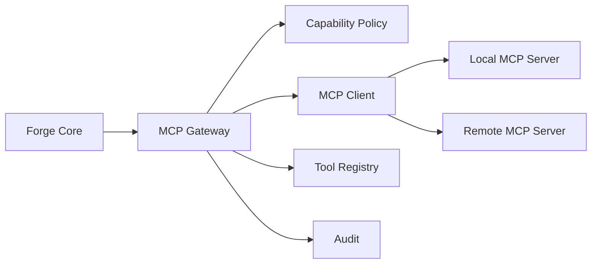

# RFC-009 — Part 3
# MCP Integration, External Tool Interoperability & Protocol Adapters

**Status:** Draft for implementation  
**Audience:** Agent platform, SDK engineering, integrations, security  
**Depends On:** RFC-009 Parts 1–2

---

## 1. Executive Summary

This document defines Forge's integration with the Model Context Protocol (MCP)
and other external tool protocols.

MCP provides a common interface for tools, resources, and prompts, but Forge must
still enforce its own:

- identity
- authorization
- capability policy
- schema validation
- tenancy
- audit
- timeout
- isolation
- data retention

An MCP server is treated as an extension provider, not as a trusted authority.

---

## 2. Integration Architecture



---

## 3. Supported MCP Primitives

Forge may support:

- tools
- resources
- prompts

Initial priority:

1. tools
2. resources
3. prompts

---

## 4. MCP Server Registration

Registration includes:

- server identity
- transport
- endpoint or command
- authentication mode
- organization scope
- advertised capabilities
- trust level
- data residency
- health status

---

## 5. Transport Modes

Potential transports:

- stdio
- HTTP streaming
- WebSocket
- server-sent events where supported

Transport support must be versioned.

---

## 6. Discovery

Forge discovers MCP capabilities and converts them into internal extension
descriptors.

Discovery results must be:

- validated
- normalized
- cached
- versioned
- reviewed against policy

---

## 7. Tool Mapping

MCP tool:

```json
{
  "name": "create_issue",
  "description": "Create an issue",
  "inputSchema": {}
}
```

Forge internal mapping:

```json
{
  "plugin_id": "mcp.server.acme",
  "extension_id": "tool.create_issue",
  "type": "tool",
  "input_schema": {},
  "required_capabilities": [
    "external.issue_tracker.write"
  ]
}
```

---

## 8. Capability Translation

MCP does not define Forge authorization.

Forge maps each external tool to capabilities.

Examples:

- file read tool → repository.files.read
- GitHub comment tool → external.github.write
- cloud query tool → external.cloud.read
- deployment tool → production.deploy

Unknown tools default to denied.

---

## 9. Tool Description Trust

Tool names and descriptions are untrusted metadata.

Forge must not rely on descriptions for permission decisions.

Authorization comes from:

- administrator mapping
- publisher policy
- curated registry metadata
- explicit user approval

---

## 10. MCP Resources

Resources may contribute context.

Controls:

- explicit selection
- size limits
- content classification
- caching
- freshness
- provenance
- prompt-injection scanning
- secret filtering

---

## 11. MCP Prompts

MCP prompts may be imported as templates, but must:

- be versioned
- be reviewed
- declare variables
- pass policy checks
- not override Forge system policy
- be rendered in a constrained section

---

## 12. Prompt Injection Defense

External content may attempt to influence the model.

Mitigations:

- label external content
- isolate instructions from data
- filter secrets
- ignore authority claims
- restrict downstream tools
- validate model outputs
- require approvals for privileged actions

---

## 13. Authentication

Supported modes may include:

- OAuth
- API token
- mutual TLS
- signed requests
- workload identity

Credentials remain in Forge's secret manager.

---

## 14. Multi-Tenancy

Each MCP installation is scoped.

Scopes:

- user
- organization
- repository
- environment

One tenant must never reuse another tenant's session or credentials.

---

## 15. Session Management

Session state may include:

- server connection
- negotiated protocol version
- discovered tools
- resource subscriptions
- authentication state

Sessions are revocable.

---

## 16. Request Translation

Forge invocation → MCP call:

1. validate Forge input
2. authorize capability
3. map schema
4. apply timeout
5. call server
6. normalize result
7. validate output
8. audit

---

## 17. Result Normalization

MCP results are normalized into:

- content
- structured data
- artifacts
- warnings
- diagnostics
- provenance

Raw protocol details should not leak into feature code.

---

## 18. Error Translation

Map protocol errors into Forge errors:

- MCP_METHOD_NOT_FOUND → EXTENSION_NOT_FOUND
- MCP_INVALID_PARAMS → INVALID_INPUT
- transport failure → DEPENDENCY_UNAVAILABLE
- timeout → TIMEOUT
- auth failure → AUTHENTICATION_FAILED

---

## 19. Server Health

Health signals:

- connection success
- discovery success
- tool success
- latency
- auth status
- schema stability
- error rate

---

## 20. Tool Version Drift

MCP servers may change tools without notice.

Forge must detect:

- added tools
- removed tools
- input schema change
- output behavior change
- description change

Breaking changes may disable the tool pending review.

---

## 21. Allowlisting

Organizations may define:

- approved MCP servers
- approved tools
- denied tools
- allowed data scopes
- allowed environments

---

## 22. Local MCP Servers

Local MCP servers run inside controlled runtime environments.

They must not inherit developer machine credentials in production.

---

## 23. Remote MCP Servers

Remote servers require:

- TLS
- authentication
- request limits
- egress allowlist
- data transfer audit
- region policy
- contractual trust assessment where needed

---

## 24. Caching

Cache:

- discovery metadata
- static resources
- prompt definitions

Do not cache sensitive dynamic tool results unless policy allows.

---

## 25. Observability

Metrics:

- mcp_servers
- mcp_discovery_failures
- mcp_tool_calls
- mcp_tool_latency
- schema_changes
- auth_failures
- capability_denials
- data_bytes_transferred

---

## 26. Testing

- discovery
- tool invocation
- schema mismatch
- server outage
- session expiry
- auth rotation
- malicious tool metadata
- prompt injection content
- multi-tenant isolation

---

## 27. Acceptance Criteria

- MCP servers register through Forge
- discovery is normalized
- tools map to capabilities
- descriptions are not trusted for auth
- credentials are brokered
- external resources are labeled
- prompt injection defenses exist
- schema drift is detected
- health is monitored
- tenants are isolated

---

## 28. Implementation Checklist

- [ ] MCP client
- [ ] server registry
- [ ] discovery adapter
- [ ] capability mapper
- [ ] result normalizer
- [ ] session manager
- [ ] drift detector
- [ ] resource sanitizer
- [ ] security tests
- [ ] example MCP integration

---

**End of RFC-009 Part 3**
