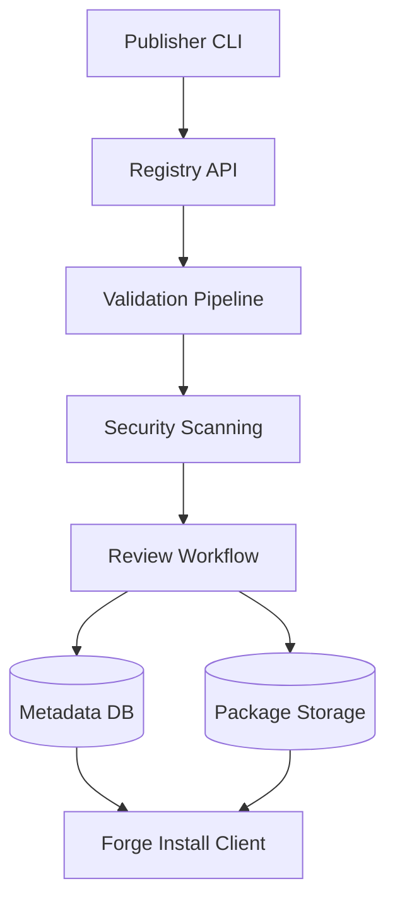

# RFC-009 — Part 4
# Plugin Registry, Publishing, Versioning, Distribution & Marketplace Architecture

**Status:** Draft for implementation  
**Audience:** Platform engineering, developer experience, security, product, legal stakeholders  
**Depends On:** RFC-009 Parts 1–3

---

## 1. Executive Summary

This document defines how extensions are packaged, published, reviewed,
distributed, installed, upgraded, deprecated, and removed.

The initial Forge registry may be private and curated. The architecture should
still support a future public marketplace without making unverified code appear
trusted.

---

## 2. Registry Responsibilities

The registry stores:

- plugin metadata
- versions
- package digests
- signatures
- publisher identity
- schemas
- capabilities
- compatibility
- review status
- vulnerability state
- installation metrics
- deprecation status

---

## 3. Registry Architecture



---

## 4. Package Format

A package contains:

```text
plugin.yaml
schemas/
README.md
LICENSE
CHANGELOG.md
dist/
signatures/
sbom/
```

Container-based plugins may reference an immutable OCI image digest.

---

## 5. Publishing Flow

1. authenticate publisher
2. reserve namespace
3. validate package
4. generate digest
5. verify signature
6. scan dependencies
7. inspect capabilities
8. run automated tests
9. review if required
10. publish immutable version

---

## 6. Publisher Identity

Publisher trust levels:

- internal
- verified
- community
- unverified
- suspended

Verification may include:

- domain verification
- organization identity
- signing key
- support contact
- security contact

---

## 7. Versioning

Use semantic versioning where practical.

- major: breaking contract or behavior
- minor: backward-compatible capability
- patch: fixes

The registry must track protocol compatibility separately from plugin version.

---

## 8. Immutable Versions

Published versions cannot be replaced.

A compromised or broken version may be:

- yanked
- blocked
- quarantined

But its historical metadata remains.

---

## 9. Release Channels

- stable
- beta
- alpha
- internal

Organizations may select allowed channels.

---

## 10. Compatibility Resolution

The installer resolves:

- Forge version
- SDK protocol
- runtime
- architecture
- dependencies
- organization policy
- capability policy

---

## 11. Dependencies Between Plugins

Plugin-to-plugin dependencies should be discouraged initially.

When supported:

- exact constraints
- acyclic graph
- conflict detection
- isolated dependency resolution
- transitive capability review

---

## 12. Installation Policy

Organizations may allow:

- internal plugins only
- verified publishers
- curated allowlist
- any signed plugin
- no third-party plugins

---

## 13. Permission Review UX

Installation must display:

- requested capabilities
- privileged capabilities
- data accessed
- external domains
- secrets used
- environments affected
- publisher trust
- security review state

---

## 14. Upgrade Strategy

Upgrade modes:

- manual
- notify only
- automatic patch
- automatic minor
- pinned

Privileged plugins should default to manual or patch-only updates.

---

## 15. Safe Upgrade

Before activation:

1. resolve compatibility
2. run health check
3. compare capabilities
4. identify new permissions
5. stage rollout
6. monitor
7. rollback if needed

New capabilities require renewed approval.

---

## 16. Rollback

The platform retains prior versions subject to policy.

Rollback includes:

- package version
- configuration schema
- capability grants
- runtime settings

---

## 17. Configuration Migration

Plugins may ship migration steps.

Rules:

- declarative preferred
- reversible where possible
- isolated
- validated
- backed up
- audited

---

## 18. Deprecation

Deprecation metadata includes:

- reason
- replacement
- date
- support end
- security impact

---

## 19. Uninstallation

Uninstallation must:

- disable invocations
- revoke grants
- remove credentials
- stop sessions
- preserve audit history
- apply data retention policy
- remove UI surfaces

---

## 20. Security Review

Automated checks:

- malware
- vulnerabilities
- secrets
- licenses
- dangerous syscalls
- network behavior
- manifest mismatch
- SBOM

Manual review may be required for:

- write capabilities
- secrets
- deployment
- arbitrary network
- UI embedding
- policy extensions

---

## 21. Certification Levels

Possible labels:

- Forge Verified
- Security Reviewed
- Enterprise Ready
- Open Source
- First Party

Labels must have precise criteria.

---

## 22. Marketplace Discovery

Search dimensions:

- category
- publisher
- capability
- compatibility
- trust
- rating
- popularity
- last updated

Popularity must not override security warnings.

---

## 23. Ratings and Reviews

Future marketplace reviews should distinguish:

- usability
- reliability
- support
- security concerns

Abuse moderation is required before public launch.

---

## 24. Analytics

Publisher analytics may include:

- installations
- active installations
- invocation success
- latency
- version adoption
- crash rate

No customer source code is exposed.

---

## 25. Registry API

Example endpoints:

```text
GET  /v1/plugins
GET  /v1/plugins/{id}
GET  /v1/plugins/{id}/versions
POST /v1/plugins/publish
POST /v1/installations
POST /v1/installations/{id}/upgrade
POST /v1/installations/{id}/disable
DELETE /v1/installations/{id}
```

---

## 26. Data Model

Core entities:

- publishers
- plugins
- plugin_versions
- packages
- signatures
- security_reviews
- installations
- grants
- configurations
- deprecations
- vulnerabilities

---

## 27. Supply Chain Security

- signed packages
- immutable digests
- SBOM
- provenance
- registry access controls
- protected publishing keys
- transparency log where possible

---

## 28. Acceptance Criteria

- registry versions are immutable
- publishers are identified
- packages are signed
- automated scanning exists
- installation policy is enforceable
- upgrades detect capability changes
- rollback works
- uninstallation revokes authority
- audit history remains
- compatibility resolution is deterministic

---

## 29. Implementation Checklist

- [ ] registry API
- [ ] package format
- [ ] publisher CLI
- [ ] signing
- [ ] scanning pipeline
- [ ] review workflow
- [ ] installation resolver
- [ ] upgrade engine
- [ ] rollback
- [ ] deprecation support

---

**End of RFC-009 Part 4**
