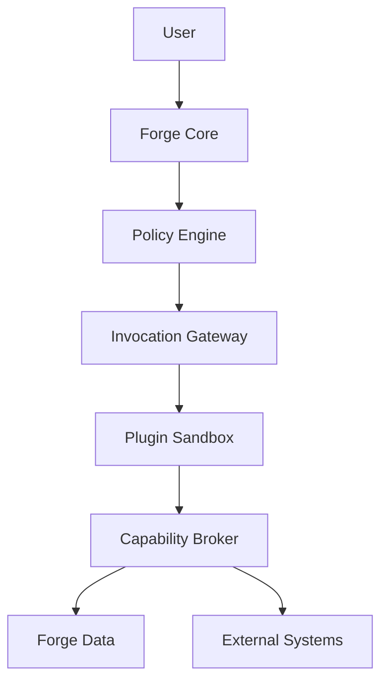

# RFC-009 — Part 5
# Plugin Security, Governance, Trust, Policy Enforcement & Threat Modeling

**Status:** Draft for implementation  
**Audience:** Security engineering, platform engineering, enterprise architecture, SRE  
**Depends On:** RFC-009 Parts 1–4

---

## 1. Executive Summary

Extensions create one of the largest security surfaces in Forge.

Plugins may process private code, invoke external services, propose file changes,
or participate in autonomous workflows. This RFC defines the trust model and
security controls required to prevent extensions from becoming a path to data
exfiltration, privilege escalation, supply-chain compromise, or unsafe actions.

---

## 2. Trust Levels

### First Party

Built and operated by Forge.

### Verified Third Party

Publisher verified and plugin reviewed.

### Community

Signed but not fully reviewed.

### Untrusted

Local or development plugin.

Trust level affects:

- runtime class
- capabilities
- network
- installation policy
- review
- monitoring

---

## 3. Threat Model

Threats include:

- malicious plugin
- compromised publisher
- dependency compromise
- sandbox escape
- capability escalation
- confused deputy
- secret theft
- source code exfiltration
- prompt injection
- deceptive UI
- denial of service
- persistence after uninstall
- cross-tenant access

---

## 4. Security Boundaries



No plugin bypasses the broker.

---

## 5. Capability Escalation Defense

- manifest capabilities immutable per version
- runtime token scoped to invocation
- secondary authorization at use
- path and resource constraints
- no wildcard privileged grants by default
- new capabilities require reapproval

---

## 6. Confused Deputy Defense

The capability broker validates:

- caller plugin
- invocation
- user
- organization
- target resource
- requested action
- grant constraints

---

## 7. Source Code Exfiltration Defense

Controls:

- no default network
- domain allowlists
- egress proxy
- byte limits
- content scanning
- access auditing
- organization policy
- approval for sensitive transfers

---

## 8. Secret Defense

Preferred order:

1. brokered external API call
2. short-lived scoped credential
3. raw secret injection only when unavoidable

Secrets must be:

- masked
- short-lived
- revocable
- purpose-bound
- unavailable after invocation

---

## 9. Prompt Injection

Plugins may supply context containing hostile instructions.

Controls:

- provenance labeling
- separate data and instruction channels
- system policy precedence
- tool permissions independent of model text
- output validation
- approval gates
- secret filtering

---

## 10. UI Security

Plugin-rendered UI should use declarative components.

Avoid arbitrary JavaScript.

A renderer schema may allow:

- text
- tables
- badges
- charts
- links
- code blocks
- forms with declared actions

Unsafe HTML is prohibited.

---

## 11. Data Classification

Plugins declare supported data classes:

- public
- internal
- confidential
- restricted
- secret

Runtime policy rejects incompatible access.

---

## 12. Tenant Isolation

Every storage access includes tenant scope.

Plugin caches must not mix tenants.

Remote services must receive tenant identifiers only when required and approved.

---

## 13. Policy Engine

Policy inputs:

- plugin trust
- publisher
- capability
- user role
- organization
- repository
- environment
- data class
- runtime
- network destination

Decision:

- allow
- deny
- require approval
- constrain
- require stronger runtime

---

## 14. Example Policy

```rego
deny[msg] {
  input.capability == "repository.files.write"
  input.plugin.trust == "community"
  input.environment == "production"
  msg := "Community plugins cannot write production repositories"
}
```

---

## 15. Security Events

Emit events for:

- capability denied
- suspicious egress
- invalid signature
- sandbox violation
- repeated crash
- secret access
- policy override
- quarantine
- revoked plugin

---

## 16. Anomaly Detection

Potential signals:

- unusual data volume
- new external domain
- repeated permission denial
- sudden invocation increase
- execution time increase
- unexpected artifacts
- cross-repository access attempts

---

## 17. Vulnerability Response

When a plugin vulnerability is discovered:

1. assess severity
2. identify installations
3. quarantine or block version
4. notify organizations
5. revoke active sessions
6. recommend upgrade
7. preserve evidence
8. review impact

---

## 18. Publisher Compromise

Controls:

- signing key revocation
- emergency blocklist
- transparency log
- out-of-band verification
- staged publishing
- account MFA

---

## 19. Sandbox Escape Response

1. isolate node
2. stop affected workloads
3. rotate node credentials
4. preserve forensic evidence
5. inspect neighboring workloads
6. patch runtime
7. notify affected customers if required

---

## 20. Governance

Organizations may define:

- approved publishers
- allowed capabilities
- denied environments
- required review
- retention
- audit export
- installation owners
- renewal periods

---

## 21. Periodic Review

Privileged installations should be reviewed periodically.

Review:

- owner
- business purpose
- capabilities
- usage
- version
- publisher health
- security findings

---

## 22. Policy Overrides

Overrides require:

- authorized role
- reason
- time limit
- affected scope
- audit event
- review

---

## 23. Security Testing

- static analysis
- dependency scanning
- malicious fixture suite
- sandbox escape tests
- network exfiltration tests
- secret theft tests
- cross-tenant tests
- UI injection tests
- prompt injection tests

---

## 24. Penetration Testing

High-risk runtime and broker components should receive external review before
public third-party plugin support.

---

## 25. Compliance Support

The extension platform should support:

- audit exports
- data residency
- retention controls
- vendor inventory
- subprocessor tracking
- access review
- incident evidence

---

## 26. Acceptance Criteria

- trust levels are enforced
- all data access is brokered
- privileged capability escalation is blocked
- network egress is controlled
- secret access is minimized
- UI output is declarative
- policy decisions are auditable
- anomalies are detectable
- emergency quarantine works
- cross-tenant isolation is tested

---

## 27. Implementation Checklist

- [ ] trust registry
- [ ] policy engine
- [ ] egress proxy
- [ ] secret broker
- [ ] declarative renderer
- [ ] anomaly rules
- [ ] emergency blocklist
- [ ] review workflow
- [ ] security test corpus
- [ ] penetration test

---

**End of RFC-009 Part 5**
