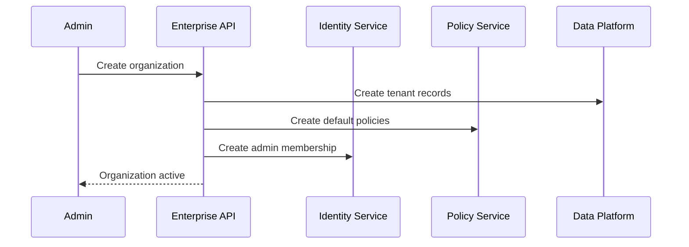

# RFC-010 — Part 1
# Enterprise Architecture, Organizations, Workspaces & Multi-Tenancy

**Status:** Draft for implementation  
**RFC Owner:** Forge Enterprise Platform  
**Audience:** Platform engineers, security engineers, backend engineers, enterprise architects, SRE, product leadership  
**Depends On:** RFC-001 through RFC-009  
**Normative Language:** MUST, SHOULD, MAY are used as defined by RFC 2119.

---

## 1. Executive Summary

This RFC defines the enterprise architecture for Forge AI.

Forge must support individual developers, teams, and large organizations while
preserving strict tenant isolation, deterministic authorization, auditable
administration, configurable data governance, and predictable operational
boundaries.

The enterprise model introduces:

- organizations
- workspaces
- projects
- teams
- memberships
- enterprise policies
- identity federation
- role and attribute-based access control
- data residency
- retention
- audit exports
- entitlements
- quotas
- administrative control planes

The core principle is:

> Every request, event, object, secret, execution, artifact, and policy decision
> is evaluated within an explicit tenant scope.

No system component may infer tenancy from ambient process state.

---

## 2. Goals

RFC-010 establishes:

- tenant hierarchy
- organization and workspace model
- resource ownership
- multi-tenant data isolation
- tenant-aware eventing
- enterprise administrative boundaries
- identity and access management
- policy enforcement
- auditability
- compliance controls
- data governance
- billing and entitlements
- operational readiness

---

## 3. Non-Goals

This RFC does not define:

- legal contract language
- country-specific tax implementation
- customer success processes
- marketplace revenue sharing
- end-user pricing pages
- every certification requirement

---

## 4. Tenant Hierarchy

Recommended hierarchy:

```text
Enterprise Account
└── Organization
    ├── Workspace
    │   ├── Project
    │   │   ├── Repository
    │   │   ├── Plans
    │   │   ├── Runs
    │   │   └── Artifacts
    │   └── Teams
    └── Organization Policies
```

### 4.1 Enterprise Account

Optional parent for customers with multiple organizations.

Use cases:

- regional subsidiaries
- business units
- separate legal entities
- centralized procurement
- unified identity federation

### 4.2 Organization

Primary security and billing tenant.

Owns:

- users and memberships
- workspaces
- provider configurations
- enterprise policies
- audit logs
- billing
- retention
- data residency

### 4.3 Workspace

Operational collaboration boundary.

A workspace may represent:

- product
- department
- engineering group
- environment
- customer project

### 4.4 Project

Logical grouping for repositories and execution history.

---

## 5. Resource Ownership

Every persistent entity MUST include an explicit ownership scope.

Example:

```text
organization_id
workspace_id
project_id
repository_id
```

Not all levels are required for every entity, but organization ownership is
mandatory for enterprise data.

---

## 6. Tenant Context

Canonical request context:

```ts
type TenantContext = {
  enterpriseAccountId?: string;
  organizationId: string;
  workspaceId?: string;
  projectId?: string;
  actorId: string;
  actorType: 'user' | 'service' | 'automation';
  requestId: string;
  correlationId: string;
};
```

Tenant context must be:

- authenticated
- immutable during the request
- propagated to background jobs
- included in audit
- validated at storage boundaries

---

## 7. Multi-Tenant Architecture Models

### 7.1 Shared Application, Shared Database

Tenant separation through row-level scope.

Advantages:

- cost efficient
- simple operations
- fast onboarding

Risks:

- query bugs
- noisy neighbors
- larger blast radius

### 7.2 Shared Application, Database per Tenant

Advantages:

- strong data isolation
- easier tenant export
- easier residency

Risks:

- operational complexity
- migration fan-out
- connection management

### 7.3 Dedicated Deployment

Advantages:

- maximum isolation
- customer-controlled networking
- custom compliance

Risks:

- high cost
- release coordination
- configuration drift

---

## 8. Recommended Isolation Tiers

### Standard

- shared control plane
- shared database with row-level security
- isolated execution sandboxes
- tenant-scoped encryption metadata

### Enterprise Isolated

- shared application
- dedicated database or schema
- dedicated worker pools optional
- dedicated encryption key optional

### Dedicated

- dedicated application deployment
- dedicated data stores
- customer-specific networking
- separate observability boundary

---

## 9. Database Isolation

All tenant-owned tables MUST contain `organization_id`.

Recommended controls:

- database row-level security
- tenant-aware repositories
- composite indexes with organization ID
- foreign keys including tenant scope where practical
- automated cross-tenant test suite

Example:

```sql
CREATE POLICY tenant_isolation ON repositories
USING (organization_id = current_setting('forge.organization_id')::uuid);
```

Application filtering alone is insufficient for high-value enterprise data.

---

## 10. Tenant-Aware Repository Layer

All repository methods require tenant context.

Bad:

```ts
getRepository(repositoryId)
```

Required:

```ts
getRepository(organizationId, repositoryId)
```

The repository layer must reject missing tenant context.

---

## 11. Object Storage Isolation

Recommended path structure:

```text
organizations/{organization_id}/
  repositories/{repository_id}/
  executions/{execution_id}/
  artifacts/
  logs/
  context/
```

Controls:

- tenant-bound signed URLs
- short expiry
- bucket policies
- object tags
- per-tenant encryption key references
- audit logging

---

## 12. Redis Isolation

Tenant-sensitive cache keys include organization scope.

Example:

```text
org:{organization_id}:repo:{repository_id}:memory:{version}
```

Redis must not be the only authorization boundary.

---

## 13. Event Isolation

Every event includes:

- organization_id
- workspace_id when applicable
- actor
- aggregate
- correlation ID
- classification

Consumers must validate tenant ownership before mutation.

---

## 14. Tenant-Aware Queues

Queues may be shared, but each job includes immutable tenant metadata.

For large customers, dedicated queues may support:

- reserved capacity
- stronger isolation
- custom regions
- contractual SLOs

---

## 15. Noisy Neighbor Controls

Controls:

- per-organization concurrency
- token quotas
- execution limits
- storage quotas
- fair scheduling
- rate limits
- reserved capacity
- queue priority

---

## 16. Organization Lifecycle

States:

- provisioning
- active
- suspended
- restricted
- closing
- deleted

### 16.1 Provisioning

Creates:

- organization record
- default workspace
- default roles
- encryption context
- audit stream
- billing account
- policy set

### 16.2 Suspension

Suspension may block:

- new executions
- new imports
- provider usage
- member invitations

Read-only access may remain depending on reason.

### 16.3 Deletion

Deletion requires:

- retention review
- legal hold check
- export opportunity
- credential revocation
- delayed purge
- audit record preservation

---

## 17. Workspace Lifecycle

States:

- active
- archived
- locked
- deleted

Archived workspaces remain readable according to policy.

---

## 18. Membership Model

Membership connects a principal to an organization.

Principals:

- user
- service account
- group
- automation identity

Membership attributes:

- role
- teams
- status
- source
- expiry
- last reviewed
- identity provider
- invited by

---

## 19. Teams

Teams support:

- repository ownership
- approval routing
- policy targeting
- notification targeting
- access review

Teams may be:

- manually managed
- SCIM-managed
- identity-provider group mapped

---

## 20. Organization Settings

Enterprise settings include:

- identity provider
- allowed domains
- session lifetime
- MFA requirements
- data residency
- retention
- model provider policy
- plugin policy
- execution policy
- audit export
- billing
- support access

---

## 21. Organization Bootstrap



---

## 22. Data Partitioning

Partitioning options:

- organization ID hash
- region
- plan tier
- database cluster
- time for append-only tables

Audit and event tables may require time partitioning.

---

## 23. Tenant Migration

Forge must support moving a tenant between:

- database clusters
- regions
- isolation tiers
- deployment classes

Migration requirements:

- consistency checkpoint
- copy verification
- write freeze or dual-write strategy
- credential rotation
- DNS or routing update
- rollback plan

---

## 24. Tenant Export

Export may include:

- repositories metadata
- plans
- runs
- verification results
- audit events
- configuration
- plugin installations
- membership data

Exports should be encrypted and time-limited.

---

## 25. Support Access

Support access is sensitive.

Requirements:

- explicit customer approval or policy
- time-limited grant
- reason
- scoped resources
- full audit
- no secret access by default
- automatic expiry

---

## 26. Service Accounts

Service accounts require:

- organization ownership
- explicit capabilities
- credential rotation
- expiry
- audit
- no interactive login

---

## 27. Administrative Domains

Enterprise admin surfaces:

- organization management
- identity
- access
- policies
- audit
- integrations
- security
- usage
- billing
- data governance

---

## 28. Acceptance Criteria

Part 1 is complete when:

- tenant hierarchy is implemented
- all enterprise resources have explicit ownership
- row-level security is enabled
- event and queue payloads are tenant-aware
- storage paths are tenant-scoped
- noisy-neighbor controls exist
- organization lifecycle is auditable
- support access is controlled
- tenant migration is designed
- isolation tiers are supported

---

## 29. Implementation Checklist

- [ ] organization schema
- [ ] workspace schema
- [ ] tenant context middleware
- [ ] row-level security
- [ ] tenant-aware repository layer
- [ ] object storage policy
- [ ] tenant event envelope
- [ ] organization bootstrap service
- [ ] suspension workflow
- [ ] export workflow
- [ ] support access grants

---

**End of RFC-010 Part 1**
