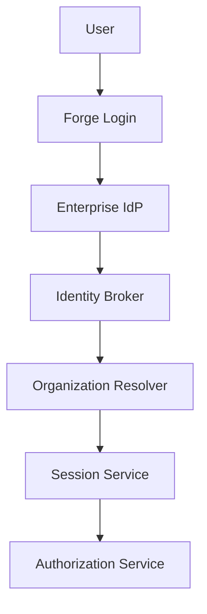

# RFC-010 — Part 2
# Enterprise Identity, SSO, SCIM, Domains, Sessions & Service Principals

**Status:** Draft for implementation  
**Audience:** Identity engineers, security engineers, backend engineers, enterprise administrators  
**Depends On:** RFC-010 Part 1

---

## 1. Executive Summary

This document defines enterprise identity and lifecycle management for Forge.

Forge must support:

- SAML 2.0
- OpenID Connect
- domain verification
- SSO enforcement
- SCIM provisioning
- group synchronization
- just-in-time provisioning
- service accounts
- session controls
- break-glass identities
- identity audit

Identity federation authenticates the principal. Authorization remains a Forge
policy decision.

---

## 2. Identity Architecture

---

## 3. Supported Identity Modes

- passwordless personal account
- social OAuth for non-enterprise use
- SAML SSO
- OIDC SSO
- service account credentials
- workload identity
- break-glass administrator

Enterprise organizations may disable personal login for organization access.

---

## 4. Domain Verification

Verification methods:

- DNS TXT
- DNS CNAME
- approved email challenge for limited cases

A verified domain may support:

- organization discovery
- invitation restrictions
- SSO enforcement
- domain capture policy

Domain ownership changes must be auditable.

---

## 5. SSO Configuration

Configuration includes:

- protocol
- issuer
- entity ID
- metadata URL
- certificate
- client ID
- redirect URI
- claim mappings
- group mappings
- logout behavior

---

## 6. SAML

SAML controls:

- signed assertions
- signed responses where supported
- audience validation
- issuer validation
- time skew bounds
- replay protection
- certificate rotation
- encrypted assertions optional

---

## 7. OpenID Connect

OIDC controls:

- authorization code flow
- PKCE
- nonce
- state
- issuer validation
- audience validation
- JWKS rotation
- short-lived authorization code
- token replay defense

---

## 8. Identity Claim Mapping

Canonical attributes:

- external_subject
- email
- display_name
- first_name
- last_name
- groups
- department
- employee_type
- manager
- region

Only approved claims should be persisted.

---

## 9. Just-in-Time Provisioning

JIT provisioning may:

- create user
- create organization membership
- assign default role
- map groups to teams
- apply policy

JIT must not grant privileged access without explicit mapping.

---

## 10. SCIM

SCIM resources:

- Users
- Groups

Operations:

- create
- update
- deactivate
- reactivate
- group membership changes

---

## 11. SCIM Deprovisioning

Deactivation should:

- revoke sessions
- disable membership
- revoke API credentials
- remove from teams
- preserve authored audit records
- reassign owned resources if policy requires

---

## 12. Group Synchronization

Identity-provider groups may map to:

- Forge teams
- organization roles
- workspace access
- approval groups
- policy targets

Mappings must be explicit and reviewable.

---

## 13. Identity Collision

Collisions may occur when:

- same email exists under another identity
- domain is newly claimed
- social and SSO accounts overlap

Account linking requires proof of control and should not occur silently.

---

## 14. SSO Enforcement

Enforcement modes:

- optional
- required for members
- required for administrators
- required for all organization access

Grace periods may support rollout.

---

## 15. Break-Glass Accounts

Requirements:

- excluded from normal SSO dependency
- strong MFA
- offline recovery material
- tightly limited count
- alert on use
- quarterly validation
- no routine use

---

## 16. Session Security

Session properties:

- short-lived access session
- rotating refresh mechanism
- secure HTTP-only cookies
- same-site policy
- device metadata
- IP and location signals
- revocation
- inactivity timeout
- absolute timeout

---

## 17. Session Policy

Organization settings:

- maximum duration
- idle timeout
- reauthentication interval
- MFA requirement
- trusted device duration
- concurrent session limit
- IP restrictions

---

## 18. Step-Up Authentication

Required for sensitive actions:

- changing SSO
- granting admin
- rotating secrets
- enabling support access
- changing billing owner
- deleting organization
- exporting restricted data

---

## 19. Session Revocation

Triggers:

- SCIM deactivation
- password or credential reset
- admin action
- risk detection
- organization suspension
- identity provider change

Revocation should propagate across tabs and devices.

---

## 20. MFA

Supported factors may include:

- WebAuthn/passkeys
- TOTP
- recovery codes

SMS should not be the preferred enterprise factor.

---

## 21. Risk Signals

Potential signals:

- impossible travel
- new device
- new country
- repeated failures
- unusual token use
- suspicious SCIM changes
- disabled user activity

Risk response:

- challenge
- revoke
- block
- alert

---

## 22. Service Principals

Service principals represent automation.

Authentication options:

- short-lived signed token
- workload identity
- client credentials
- certificate

Static long-lived secrets should be avoided.

---

## 23. API Tokens

When supported, API tokens require:

- owner
- organization
- scopes
- expiry
- last used
- rotation
- revocation
- audit

Tokens should be hashed at rest.

---

## 24. Identity Events

Events include:

- user.provisioned
- user.deactivated
- session.created
- session.revoked
- sso.configured
- domain.verified
- scim.group.updated
- service_account.created
- mfa.changed

---

## 25. Identity Audit

Audit records include:

- actor
- target
- source identity provider
- IP
- device
- timestamp
- outcome
- correlation ID
- policy decision

---

## 26. Failure Modes

### IdP Outage

Possible behavior:

- preserve active sessions
- allow break-glass
- block new SSO logins
- show clear status
- avoid unsafe fallback to weaker auth

### Certificate Expiry

- alert in advance
- support overlapping certificates
- test new metadata
- retain rollback

### SCIM Outage

- queue updates
- monitor freshness
- alert administrators
- do not silently reactivate users

---

## 27. Acceptance Criteria

- SAML and OIDC are supported
- verified domains are implemented
- SSO enforcement is configurable
- SCIM provisions and deprovisions users
- group mapping works
- sessions are revocable
- step-up authentication exists
- break-glass identities are controlled
- service principals are scoped
- identity events are audited

---

## 28. Implementation Checklist

- [ ] identity broker
- [ ] SAML integration
- [ ] OIDC integration
- [ ] domain verification
- [ ] JIT provisioning
- [ ] SCIM Users
- [ ] SCIM Groups
- [ ] session policy engine
- [ ] step-up authentication
- [ ] break-glass workflow
- [ ] API token management

---

**End of RFC-010 Part 2**
