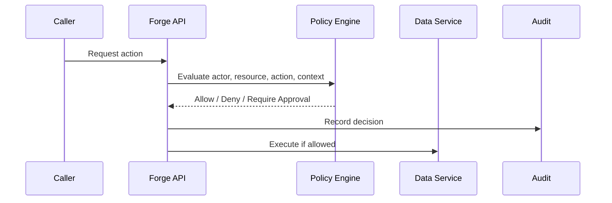
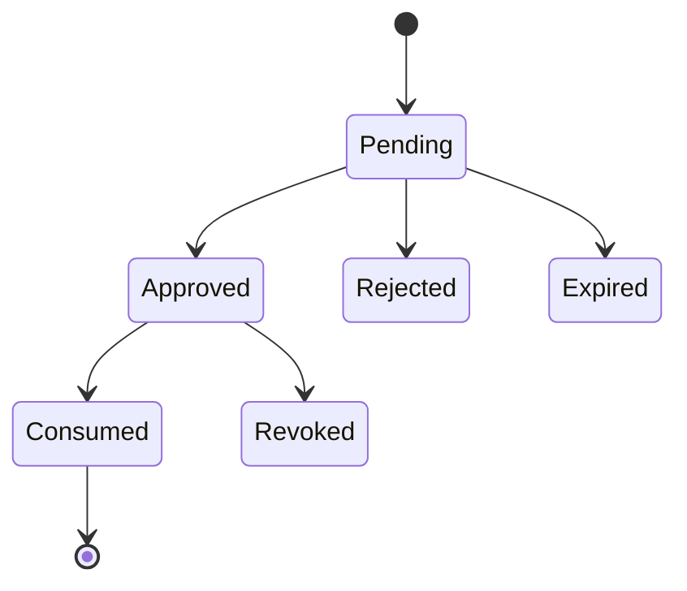

# RFC-010 — Part 3
# RBAC, ABAC, Policy Engine, Delegation & Approval Governance

**Status:** Draft for implementation  
**Audience:** Security engineers, authorization engineers, backend engineers, enterprise administrators  
**Depends On:** RFC-010 Parts 1–2

---

## 1. Executive Summary

This document defines Forge's authorization model.

Forge requires more than basic roles because permissions depend on:

- actor
- organization
- workspace
- repository
- environment
- action
- data classification
- execution risk
- plugin trust
- time
- approval state

The recommended model combines:

- RBAC for understandable administration
- ABAC for contextual restrictions
- policy-as-code for enterprise rules
- approval workflows for sensitive actions

---

## 2. Authorization Architecture



---

## 3. Authorization Decision

Canonical decision:

```json
{
  "decision": "allow",
  "reason": "role_and_policy_match",
  "policy_version": "policy_42",
  "obligations": {
    "redact_fields": [],
    "require_audit": true
  }
}
```

Possible decisions:

- allow
- deny
- require_approval
- allow_with_constraints

---

## 4. Resource Model

Resources include:

- organization
- workspace
- project
- repository
- plan
- execution
- artifact
- secret
- provider
- plugin
- audit export
- billing account
- policy

---

## 5. Action Model

Examples:

```text
organization.read
organization.manage
workspace.create
repository.connect
repository.read
repository.write
plan.create
plan.approve
execution.start
execution.cancel
artifact.export
provider.configure
secret.rotate
plugin.install
audit.export
billing.manage
```

---

## 6. Built-In Roles

### Organization Owner

Full organization control.

### Organization Admin

Manage members, workspaces, and settings excluding protected ownership actions.

### Security Admin

Manage identity, policies, audit, secrets, and security configuration.

### Billing Admin

Manage plan, invoices, and usage limits.

### Workspace Admin

Manage workspace members and resources.

### Developer

Create plans and execute within policy.

### Reviewer

Review plans, changes, and verification.

### Viewer

Read-only access.

### Auditor

Read audit and compliance records without operational mutation.

---

## 7. Custom Roles

Custom roles include:

- name
- description
- permissions
- scope
- constraints
- version
- owner

Custom roles must not exceed the creator's delegable authority.

---

## 8. Role Assignment Scope

Assignments may target:

- organization
- workspace
- project
- repository

A lower-level assignment cannot automatically grant broader scope.

---

## 9. Attribute-Based Access Control

Useful attributes:

### Actor

- department
- employment type
- identity assurance
- region
- team
- session risk

### Resource

- repository sensitivity
- environment
- owner
- classification
- customer data presence

### Action

- read
- write
- execute
- export
- administer

### Context

- time
- location
- device
- approval status
- provider
- plugin trust

---

## 10. Policy Examples

### Production Write Restriction

```text
Allow repository write only when:
- actor is in production-engineers
- MFA is recent
- plan is approved
- verification policy is attached
```

### Sensitive Repository Restriction

```text
Deny external AI provider use when repository classification is restricted.
```

### Plugin Restriction

```text
Require security approval for plugins requesting network egress and repository read.
```

---

## 11. Policy Evaluation Order

1. explicit deny
2. legal hold or suspension
3. tenant boundary
4. identity assurance
5. role grant
6. attribute constraints
7. approval requirement
8. obligations
9. default deny

---

## 12. Policy Versioning

Policies are immutable by version.

Changes require:

- draft
- validation
- simulation
- approval
- publication
- rollback option

---

## 13. Policy Simulation

Before publishing, administrators can simulate against:

- historical audit
- sample users
- sample repositories
- current role assignments

Simulation should show:

- newly denied actions
- newly allowed actions
- approval changes
- affected users

---

## 14. Delegation

Delegation permits limited administrative authority.

Example:

- workspace admin can manage workspace members
- project owner can approve project executions
- security admin can manage audit exports

Delegation is explicit and auditable.

---

## 15. Separation of Duties

Sensitive operations may require distinct actors.

Examples:

- policy author cannot approve own policy
- billing admin cannot grant security admin
- execution author cannot approve production deployment
- support agent cannot grant own support access

---

## 16. Approval Policies

Approval may depend on:

- risk
- environment
- repository classification
- file paths
- dependency changes
- database migrations
- provider
- plugin
- cost

---

## 17. Approval Modes

- single approver
- any member of group
- all required groups
- sequential approval
- quorum
- time-limited emergency approval

---

## 18. Approval Request

Required fields:

- action
- initiator
- target
- rationale
- risk
- affected resources
- policy reason
- expiration
- required approvers

---

## 19. Approval State Machine



Approvals are bound to an immutable action digest.

---

## 20. Approval Integrity

If the action changes after approval:

- approval becomes invalid
- new approval is required
- changed fields are shown

---

## 21. Emergency Override

Emergency override requires:

- authorized break-glass role
- justification
- time limit
- enhanced logging
- notification
- post-event review

---

## 22. Authorization Caching

Decisions may be cached only when:

- tenant scope is included
- actor and resource versions are included
- policy version is included
- revocation is fast
- TTL is short for privileged actions

---

## 23. Policy Obligations

An allow decision may impose:

- redaction
- watermark
- additional logging
- restricted provider
- network deny
- mandatory verification
- data retention override

---

## 24. Authorization Events

- role.assigned
- role.revoked
- policy.published
- policy.denied
- approval.requested
- approval.approved
- approval.rejected
- override.used

---

## 25. Access Reviews

Periodic review covers:

- privileged roles
- inactive users
- service accounts
- external collaborators
- repository access
- plugin grants
- support access

---

## 26. Orphaned Ownership

When an owner leaves:

- transfer organization ownership
- transfer repository ownership
- revoke credentials
- reassign approvals
- preserve audit

---

## 27. Testing

- role matrix
- cross-tenant denial
- policy precedence
- custom role boundaries
- approval invalidation
- separation of duties
- emergency override
- cache revocation
- SCIM deprovisioning

---

## 28. Acceptance Criteria

- all actions use centralized authorization
- default deny is enforced
- built-in and custom roles work
- ABAC constraints are supported
- policies are versioned
- simulation exists
- approvals bind to action digest
- separation of duties is enforceable
- overrides are audited
- access reviews are supported

---

## 29. Implementation Checklist

- [ ] permission catalog
- [ ] role service
- [ ] custom roles
- [ ] policy engine
- [ ] policy simulator
- [ ] approval service
- [ ] separation-of-duties rules
- [ ] authorization middleware
- [ ] access review workflows
- [ ] emergency override

---

**End of RFC-010 Part 3**
