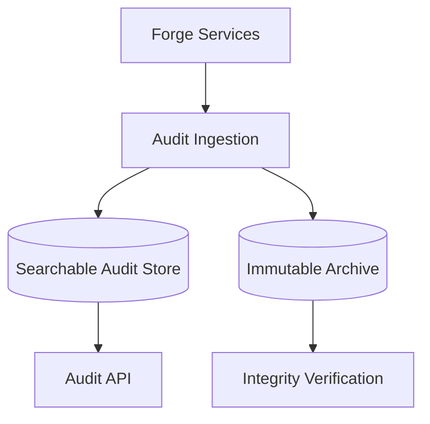

# RFC-010 — Part 4
# Audit, Compliance, Governance, Evidence, Retention & Legal Holds

**Status:** Draft for implementation  
**Audience:** Security, compliance, enterprise administrators, auditors, SRE, legal stakeholders  
**Depends On:** RFC-010 Parts 1–3

---

## 1. Executive Summary

This document defines Forge's enterprise audit and governance platform.

Audit records must make it possible to answer:

- who performed an action
- what action occurred
- which tenant and resource were affected
- when it occurred
- from where
- under which policy
- whether approval existed
- what changed
- whether the action succeeded

Audit must be tamper-evident, searchable, exportable, and retained according to
organization policy.

---

## 2. Audit Principles

- append-only
- tenant-scoped
- immutable
- timestamped
- attributable
- policy-linked
- exportable
- privacy-aware
- resistant to deletion

---

## 3. Audit Event Schema

```json
{
  "event_id": "aud_01...",
  "organization_id": "org_01...",
  "timestamp": "2026-07-20T10:00:00Z",
  "actor": {
    "type": "user",
    "id": "usr_01...",
    "email": "redacted@example.com"
  },
  "action": "plan.approve",
  "resource": {
    "type": "plan",
    "id": "plan_01..."
  },
  "outcome": "success",
  "policy": {
    "decision_id": "dec_01...",
    "version": "policy_42"
  },
  "request_id": "req_01...",
  "correlation_id": "cor_01...",
  "metadata": {}
}
```

---

## 4. Audit Categories

- authentication
- identity lifecycle
- authorization
- organization administration
- repository access
- plan and execution
- provider use
- plugin activity
- secret access
- data export
- billing
- support access
- policy changes
- infrastructure administration

---

## 5. Audit Integrity

Controls:

- append-only storage
- immutable object retention
- hash chaining or Merkle-based verification
- separate write path
- restricted deletion
- timestamp authority where required
- integrity verification jobs

---

## 6. Audit Storage

Recommended architecture:



---

## 7. Search

Search fields:

- actor
- action
- resource
- outcome
- date
- IP
- policy version
- repository
- execution
- plugin
- provider

---

## 8. Export

Export formats:

- JSONL
- CSV for simplified records
- signed archive
- streaming connector

Exports must:

- be permission-controlled
- be audited
- support date range
- include integrity metadata
- expire when downloaded through URL

---

## 9. SIEM Integration

Supported patterns:

- webhook
- syslog
- object storage delivery
- API polling
- event streaming

Delivery must handle:

- retries
- backpressure
- duplicate detection
- dead-letter queues
- health monitoring

---

## 10. Retention Policies

Retention dimensions:

- event category
- organization
- data classification
- legal requirement
- contract tier

Examples:

- authentication: 1 year
- administrative changes: 7 years
- execution logs: 90 days
- audit archive: configurable

---

## 11. Legal Holds

Legal hold prevents deletion of specified data.

Scope may include:

- organization
- user
- repository
- date range
- execution
- artifact category

---

## 12. Legal Hold Lifecycle

- draft
- active
- released
- archived

Only authorized legal or compliance roles may manage holds.

---

## 13. Deletion Interaction

Before deleting data:

1. resolve applicable retention
2. resolve legal hold
3. resolve contractual retention
4. record decision
5. delete eligible data
6. preserve required audit

---

## 14. Compliance Control Library

Forge should map technical controls to frameworks such as:

- SOC 2
- ISO 27001
- GDPR operational requirements
- enterprise internal controls

The platform should store control metadata without claiming certification solely
from implementation.

---

## 15. Evidence Collection

Evidence may include:

- access review results
- backup restore tests
- deployment approvals
- vulnerability reports
- policy versions
- key rotation records
- incident postmortems
- training attestations
- architecture diagrams

---

## 16. Evidence Automation

Evidence collectors should:

- retrieve from authoritative systems
- timestamp collection
- preserve source
- hash artifact
- mark period
- assign control
- detect missing evidence

---

## 17. Control Ownership

Every control requires:

- owner
- frequency
- implementation
- evidence source
- reviewer
- exceptions
- status

---

## 18. Policy Exceptions

Exception fields:

- control
- scope
- reason
- compensating control
- owner
- approval
- expiry
- review status

Exceptions must expire automatically.

---

## 19. Risk Register

Risks include:

- title
- description
- likelihood
- impact
- owner
- mitigation
- status
- review date

---

## 20. Vendor and Subprocessor Inventory

Track:

- service
- data accessed
- region
- purpose
- contract status
- security review
- retention
- subprocessors
- owner

---

## 21. Compliance Dashboard

Views:

- control status
- missing evidence
- overdue reviews
- open exceptions
- legal holds
- vendor risk
- incidents
- access reviews

---

## 22. Auditor Role

Auditors may:

- read audit
- read evidence
- export approved reports
- view policies
- not mutate operational resources

---

## 23. Governance Workflows

Examples:

- policy review
- access certification
- vendor review
- exception approval
- incident review
- retention review
- key rotation review

---

## 24. Audit Privacy

Audit records may contain personal data.

Controls:

- minimal collection
- field redaction
- restricted access
- retention
- export policy
- lawful deletion when possible

---

## 25. Clock Integrity

Audit timestamps depend on synchronized clocks.

Infrastructure should use:

- reliable time synchronization
- monotonic ordering where needed
- server-side timestamps
- event sequence numbers

---

## 26. Failure Modes

### Audit Ingestion Failure

- buffer locally or durably
- block privileged operation if audit is mandatory
- alert
- replay

### Export Failure

- preserve request
- retry
- avoid partial unsigned exports
- notify user

### Integrity Failure

- quarantine affected range
- alert security
- preserve evidence
- investigate write path

---

## 27. Acceptance Criteria

- audit events are append-only
- integrity is verifiable
- search is tenant-scoped
- exports are signed
- SIEM delivery is reliable
- retention is configurable
- legal holds block deletion
- evidence is collectible
- exceptions expire
- audit access is itself audited

---

## 28. Implementation Checklist

- [ ] audit schema
- [ ] ingestion service
- [ ] immutable archive
- [ ] integrity chain
- [ ] search API
- [ ] export service
- [ ] SIEM connectors
- [ ] retention engine
- [ ] legal hold service
- [ ] evidence registry
- [ ] compliance dashboard

---

**End of RFC-010 Part 4**
