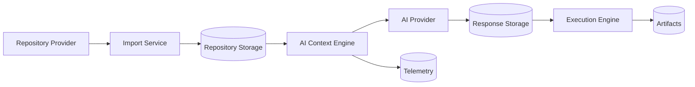
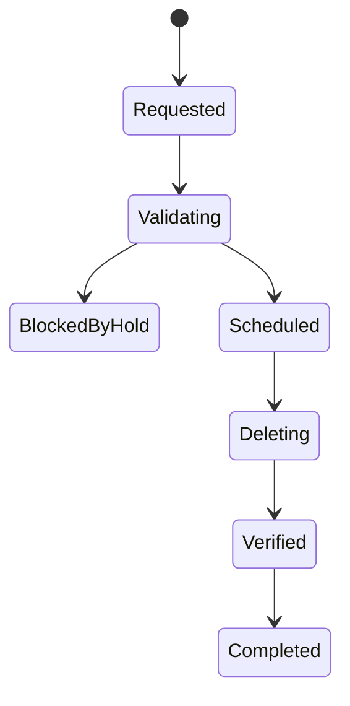

# RFC-010 — Part 5
# Data Governance, Privacy, Encryption, Residency, Retention & Customer Keys

**Status:** Draft for implementation  
**Audience:** Security engineering, privacy engineering, platform engineering, enterprise architecture  
**Depends On:** RFC-010 Parts 1–4

---

## 1. Executive Summary

This document defines how Forge classifies, stores, processes, transfers, retains,
and deletes enterprise data.

Forge may process:

- proprietary source code
- repository metadata
- prompts
- model responses
- logs
- artifacts
- credentials
- user identity data
- audit records

Data governance must be enforceable by policy and visible to enterprise
administrators.

---

## 2. Data Classification

Suggested levels:

### Public

Approved for public disclosure.

### Internal

Non-public operational information.

### Confidential

Private source, prompts, plans, execution data.

### Restricted

Secrets, credentials, sensitive customer data, regulated data.

---

## 3. Data Inventory

Each data type records:

- owner
- classification
- purpose
- system of record
- region
- retention
- encryption
- processors
- deletion method
- exportability

---

## 4. Data Flow Mapping



Every external transfer must be documented.

---

## 5. Data Minimization

Services should process only necessary data.

Examples:

- send selected context, not entire repository
- redact secrets before provider calls
- avoid logging source
- store summaries where full payload is unnecessary
- expire temporary sandboxes

---

## 6. Provider Data Policy

Per organization, administrators may control:

- allowed providers
- allowed models
- allowed data classes
- region
- retention mode
- training opt-out requirements
- fallback providers

---

## 7. Restricted Repository Policy

Restricted repositories may require:

- no external model provider
- approved private endpoint
- dedicated region
- dedicated key
- no plugin network
- enhanced audit
- manual approval

---

## 8. Encryption at Rest

Required for:

- databases
- object storage
- backups
- audit archive
- secret manager

---

## 9. Encryption in Transit

- TLS for client traffic
- TLS for service traffic
- certificate rotation
- provider TLS validation
- mTLS for sensitive internal paths where appropriate

---

## 10. Envelope Encryption

Recommended model:

```text
Customer or platform key
    ↓ encrypts
Data encryption key
    ↓ encrypts
Tenant data
```

---

## 11. Customer-Managed Keys

Enterprise option:

- customer-controlled cloud KMS key
- Forge-managed integration
- per-organization key reference
- revocation support
- rotation support
- health monitoring

---

## 12. Key Revocation

Revocation may render data unavailable.

The UI must warn about:

- execution impact
- import impact
- export impact
- backup impact

---

## 13. Key Rotation

Rotation should support:

- new writes with new key
- old data readable
- background re-encryption
- progress
- rollback
- audit

---

## 14. Secret Detection

Before data leaves Forge-controlled infrastructure:

- scan repository context
- scan logs
- scan prompts
- redact high-confidence secrets
- block restricted patterns
- record policy event

---

## 15. Redaction

Redaction must preserve:

- location metadata
- reason
- token placeholder
- deterministic references where needed

Example:

```text
<REDACTED_SECRET:github_token:1>
```

---

## 16. Data Residency

Organization may select:

- region
- allowed processing regions
- backup regions
- provider regions
- execution regions

---

## 17. Cross-Region Transfer

Transfers require:

- policy authorization
- encryption
- audit
- documented destination
- purpose
- retention

---

## 18. Retention Engine

Retention applies to:

- source snapshots
- prompt payloads
- responses
- logs
- artifacts
- audit
- backups
- deleted user data

---

## 19. Retention Precedence

Suggested order:

1. legal hold
2. legal requirement
3. contractual policy
4. organization policy
5. product default

---

## 20. Deletion Workflow



---

## 21. Deletion Verification

Verify deletion from:

- primary database
- object storage
- caches
- search indexes
- derived data
- replication
- backups according to lifecycle

---

## 22. Data Subject Requests

When applicable, support:

- access
- correction
- deletion
- portability
- restriction

Identity must be verified before processing.

---

## 23. Data Export

Exports require:

- authorization
- step-up authentication
- classification
- encryption
- expiry
- audit
- optional approval

---

## 24. Backup Data

Backups inherit:

- classification
- encryption
- residency
- retention
- legal hold obligations

---

## 25. Telemetry Privacy

Telemetry should avoid:

- source code
- prompt contents
- secrets
- personal data not required

Use:

- identifiers
- aggregates
- hashes
- sampled metadata

---

## 26. Privacy by Design

Feature reviews should ask:

- what data is collected
- why it is needed
- where it flows
- who can access it
- when it is deleted
- whether a less invasive design exists

---

## 27. Data Governance Events

- classification.changed
- residency.changed
- key.rotated
- export.created
- deletion.requested
- deletion.completed
- redaction.applied
- provider.transfer.blocked

---

## 28. Acceptance Criteria

- data types are inventoried
- classification is enforceable
- provider policy is tenant-configurable
- restricted repositories receive stronger controls
- encryption is universal
- customer-managed keys are supported by design
- secret scanning occurs before external transfer
- retention is policy-driven
- deletion is verifiable
- exports are controlled

---

## 29. Implementation Checklist

- [ ] data inventory
- [ ] classification service
- [ ] provider data policy
- [ ] secret scanner
- [ ] redaction service
- [ ] region router
- [ ] retention engine
- [ ] deletion orchestrator
- [ ] CMK integration
- [ ] data export service
- [ ] privacy review template

---

**End of RFC-010 Part 5**
