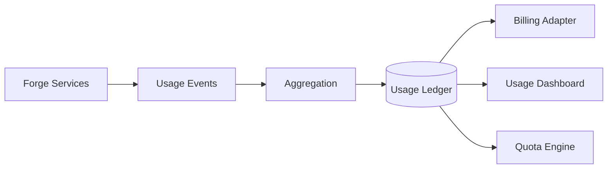

# RFC-010 — Part 6
# Entitlements, Quotas, Billing Boundaries, Administration & Enterprise Operations

**Status:** Draft for implementation  
**Audience:** Platform engineering, product, billing engineering, enterprise administrators, SRE  
**Depends On:** RFC-010 Parts 1–5

---

## 1. Executive Summary

This document defines enterprise entitlements, quotas, usage accounting, billing
boundaries, and administrative operations.

The goal is not to define prices. The goal is to create a technically correct
system for deciding:

- which capabilities an organization has
- how much of each resource it may consume
- how usage is measured
- how limits are enforced
- how administrators understand and control usage

---

## 2. Entitlement Model

Entitlements are named capabilities.

Examples:

```text
enterprise.sso
enterprise.scim
enterprise.audit_export
enterprise.customer_managed_keys
execution.concurrent.50
retention.custom
plugins.third_party
models.private_endpoint
support.premium
```

---

## 3. Entitlement Sources

- subscription plan
- contract override
- trial
- promotion
- support grant
- internal testing

Precedence must be deterministic.

---

## 4. Entitlement Evaluation

Inputs:

- organization
- plan
- contract
- feature flag
- region
- account state
- effective date

Output:

```json
{
  "enabled": true,
  "source": "contract",
  "expires_at": null,
  "constraints": {}
}
```

---

## 5. Entitlement Versioning

Changes must be:

- versioned
- effective-dated
- auditable
- reversible
- cache-invalidation aware

---

## 6. Usage Dimensions

- AI input tokens
- AI output tokens
- executions
- execution minutes
- sandbox CPU
- sandbox memory
- storage
- repositories
- active users
- plugin invocations
- audit retention
- data transfer

---

## 7. Usage Event

```json
{
  "usage_event_id": "use_01...",
  "organization_id": "org_01...",
  "dimension": "execution.cpu_seconds",
  "quantity": 184,
  "timestamp": "2026-07-20T12:00:00Z",
  "resource_id": "run_01...",
  "idempotency_key": "..."
}
```

---

## 8. Usage Integrity

Usage events must be:

- idempotent
- durable
- traceable
- tenant-scoped
- reconciled
- immutable after finalization

---

## 9. Metering Pipeline



---

## 10. Quota Types

### Hard Quota

Blocks further use.

### Soft Quota

Warns but allows temporary overage.

### Concurrency Quota

Limits simultaneous operations.

### Rate Quota

Limits operations per period.

### Budget Quota

Limits spend or estimated cost.

---

## 11. Quota Scope

- organization
- workspace
- project
- repository
- user
- provider
- model

---

## 12. Quota Enforcement

Enforcement points:

- task creation
- plan execution
- provider routing
- sandbox scheduling
- plugin invocation
- artifact upload

---

## 13. Quota Decision

```json
{
  "allowed": false,
  "dimension": "execution.concurrent",
  "limit": 20,
  "current": 20,
  "reset_at": null,
  "reason": "concurrency_limit"
}
```

---

## 14. Reservation

Long-running jobs should reserve expected quota.

Flow:

1. estimate
2. reserve
3. execute
4. settle actual
5. release difference

---

## 15. Cost Estimation

Before execution, Forge may estimate:

- token cost
- compute duration
- storage impact
- plugin cost
- external API cost

Estimates must be labeled as estimates.

---

## 16. Budget Controls

Administrators may define:

- monthly budget
- provider budget
- model budget
- workspace budget
- alert thresholds
- hard stop policy

---

## 17. Usage Dashboard

Views:

- current period
- trends
- provider
- workspace
- repository
- model
- plugin
- anomalies
- forecast

---

## 18. Billing Boundaries

Forge should isolate core platform from payment provider logic through a billing
adapter.

Core concepts:

- account
- subscription
- invoice reference
- entitlement
- usage ledger
- credit
- adjustment

---

## 19. Subscription State

- trialing
- active
- past_due
- restricted
- cancelled
- expired

Operational behavior should be explicitly mapped.

---

## 20. Past-Due Behavior

Possible graduated response:

1. notify
2. restrict new high-cost execution
3. preserve read-only access
4. suspend after policy window

Enterprise contracts may override behavior.

---

## 21. Credits

Credits require:

- source
- amount
- dimension or currency
- expiry
- audit
- usage order

---

## 22. Administrative Console

Enterprise admins manage:

- members
- teams
- roles
- SSO
- SCIM
- policies
- repositories
- providers
- plugins
- audit
- usage
- billing
- retention
- support access

---

## 23. Admin Safety

Sensitive changes require:

- step-up authentication
- confirmation
- impact preview
- audit
- rollback where possible

---

## 24. Bulk Administration

Bulk operations:

- member import
- role assignment
- repository policy
- team mapping
- workspace archive
- plugin disable

Bulk actions require dry-run support.

---

## 25. Change Preview

Before applying policy or access changes, show:

- affected users
- affected repositories
- newly allowed actions
- newly denied actions
- operational risks

---

## 26. Delegated Administration

Allow domain-specific admins:

- identity admin
- security admin
- workspace admin
- billing admin
- plugin admin

---

## 27. Enterprise Notifications

Notify on:

- SSO certificate expiry
- SCIM failures
- quota threshold
- budget threshold
- policy violation
- legal hold
- key failure
- plugin vulnerability
- privileged role change

---

## 28. Support Operations

Support workflows:

- customer-approved access
- diagnostic bundle
- tenant health
- configuration diff
- incident timeline
- safe impersonation alternative using scoped support session

---

## 29. Tenant Health

Health dimensions:

- identity
- database
- provider
- execution
- plugins
- quotas
- billing
- policy
- audit export

---

## 30. Acceptance Criteria

- entitlements are centralized
- usage is durably metered
- quotas are enforced at entry points
- reservations support long jobs
- budgets are configurable
- billing provider is abstracted
- admin console covers enterprise controls
- bulk changes support dry-run
- delegated administration works
- support access is scoped and audited

---

## 31. Implementation Checklist

- [ ] entitlement service
- [ ] usage event schema
- [ ] usage ledger
- [ ] quota engine
- [ ] reservation service
- [ ] budget alerts
- [ ] billing adapter
- [ ] subscription state machine
- [ ] admin console
- [ ] bulk dry-run
- [ ] tenant health dashboard

---

**End of RFC-010 Part 6**
