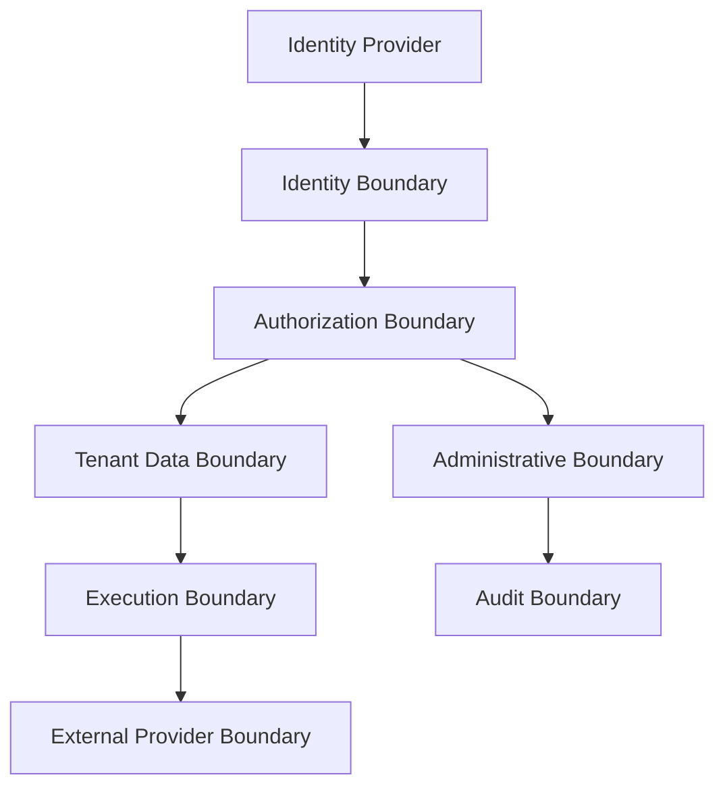

# RFC-010 — Part 7
# Enterprise Testing, Threat Model, Operations, Rollout & Production Readiness

**Status:** Draft for implementation  
**Audience:** Security, QA, SRE, platform engineering, enterprise architecture, leadership  
**Depends On:** RFC-010 Parts 1–6

---

## 1. Executive Summary

This document completes RFC-010.

It defines how the enterprise platform is tested, monitored, operated, rolled
out, and approved for production use.

Enterprise functionality touches the highest-risk areas of Forge:

- identity
- authorization
- tenant isolation
- source code confidentiality
- audit
- billing
- legal retention
- administrative privilege

The production bar must therefore be higher than for ordinary product features.

---

## 2. Enterprise Threat Model

Threat actors:

- external attacker
- malicious tenant
- compromised tenant admin
- compromised employee
- compromised identity provider
- malicious plugin
- compromised support account
- billing abuse
- accidental administrator error

---

## 3. Critical Threats

- cross-tenant data access
- authorization bypass
- SSO misbinding
- SCIM deprovisioning failure
- audit tampering
- legal hold bypass
- secret exposure
- customer key misuse
- support impersonation abuse
- quota bypass
- billing ledger corruption

---

## 4. Security Boundaries

---

## 5. Tenant Isolation Test Suite

Mandatory tests:

- random tenant ID substitution
- object ID guessing
- cross-tenant search
- cross-tenant cache access
- cross-tenant event consumption
- signed URL reuse
- background job scope loss
- admin API scope confusion
- export scope confusion
- audit query isolation

---

## 6. Authorization Test Matrix

Test dimensions:

- role
- resource
- action
- tenant
- workspace
- policy
- approval state
- identity assurance
- session risk

Automated generation of permission matrices is recommended.

---

## 7. Identity Testing

- SAML replay
- expired assertion
- wrong audience
- wrong issuer
- certificate rotation
- OIDC nonce reuse
- state mismatch
- SCIM duplicate user
- group removal
- deprovisioning
- break-glass use
- session revocation

---

## 8. Policy Testing

- explicit deny precedence
- custom role limits
- policy rollback
- approval invalidation
- separation of duties
- emergency override
- policy simulation accuracy

---

## 9. Audit Testing

- append-only behavior
- missing event detection
- hash-chain verification
- export signature
- SIEM retry
- legal hold audit
- audit of audit access
- clock skew

---

## 10. Data Governance Testing

- classification enforcement
- provider restriction
- residency routing
- redaction
- secret detection
- retention expiration
- deletion verification
- key revocation
- backup retention

---

## 11. Billing and Quota Testing

- duplicate usage event
- missing usage event
- late event
- reservation settlement
- hard quota
- soft quota
- plan change
- credit application
- billing outage
- tenant suspension

---

## 12. Performance Testing

Enterprise-scale scenarios:

- 100,000 users
- 10,000 organizations
- large SCIM sync
- large group mapping
- audit search over billions of events
- concurrent authorization checks
- tenant export
- policy simulation over historical data

---

## 13. Reliability Testing

- IdP outage
- SCIM outage
- authorization service outage
- audit pipeline outage
- key management outage
- billing provider outage
- database failover
- region failover

---

## 14. Chaos Engineering

Inject failures into:

- policy cache
- tenant routing
- audit queue
- session store
- KMS
- SIEM connector
- quota ledger
- billing adapter

---

## 15. Penetration Testing

External assessment should cover:

- tenant isolation
- identity federation
- admin APIs
- plugin permissions
- support access
- data export
- customer-managed keys
- execution sandboxes

---

## 16. Observability

Enterprise dashboards:

- SSO health
- SCIM health
- authorization denials
- policy latency
- tenant isolation alerts
- audit ingestion
- SIEM delivery
- key health
- retention backlog
- usage pipeline
- quota enforcement

---

## 17. Enterprise SLOs

Suggested:

| Capability | SLO |
|---|---:|
| Authentication availability | 99.95% |
| Authorization availability | 99.99% |
| Authorization latency p99 | <100ms |
| Audit durability | 99.999% |
| SCIM processing | 99% < 5 min |
| Session revocation propagation | 99% < 1 min |
| Quota decision availability | 99.95% |
| Tenant isolation breach | 0 tolerated |

---

## 18. Alerting

Immediate alerts:

- possible cross-tenant access
- audit integrity failure
- unauthorized support access
- customer key failure
- legal hold bypass
- SSO widespread failure
- quota bypass
- privileged role escalation anomaly

---

## 19. Incident Runbooks

Required:

- cross-tenant exposure
- identity provider compromise
- SSO certificate failure
- SCIM deprovisioning delay
- authorization outage
- audit loss
- customer key revocation
- legal hold failure
- billing ledger inconsistency
- support access misuse

---

## 20. Runbook — Suspected Cross-Tenant Access

1. declare SEV-1
2. disable affected path
3. preserve logs and traces
4. identify tenants and resources
5. revoke active sessions if required
6. rotate credentials
7. verify containment
8. assess disclosure obligations
9. remediate
10. complete postmortem

---

## 21. Runbook — Authorization Service Outage

1. fail closed for privileged writes
2. preserve safe cached read decisions only if policy allows
3. disable administrative changes
4. restore service
5. invalidate caches
6. reconcile pending approvals
7. audit outage behavior

---

## 22. Rollout Plan

### Phase 1 — Internal Enterprise Foundations

- organizations
- roles
- tenant scope
- audit
- basic SSO

### Phase 2 — Design Partners

- SCIM
- custom roles
- policies
- audit export
- retention

### Phase 3 — General Enterprise Availability

- CMK
- data residency
- SIEM
- legal holds
- advanced admin

### Phase 4 — Dedicated Deployments

- isolated databases
- dedicated regions
- customer networking
- custom compliance controls

---

## 23. Migration from Single-Tenant Model

Migration steps:

1. create default organization
2. backfill organization IDs
3. enable tenant-aware repositories
4. enable row-level security
5. migrate events and objects
6. verify isolation
7. remove unscoped APIs

---

## 24. Feature Flags

Flags for:

- SSO
- SCIM
- custom roles
- policy engine
- legal holds
- CMK
- data residency
- billing enforcement
- dedicated tenant routing

---

## 25. Operational Reviews

Weekly:

- identity failures
- authorization anomalies
- tenant isolation checks
- audit pipeline
- quota anomalies

Monthly:

- access reviews
- break-glass review
- key status
- retention status
- legal hold status
- compliance evidence

Quarterly:

- restore test
- penetration test review
- policy review
- support access review
- DR exercise

---

## 26. Documentation

Required:

- administrator guide
- SSO setup
- SCIM setup
- role reference
- policy language
- audit export
- SIEM integration
- retention
- CMK
- data residency
- incident response
- migration guide

---

## 27. Support Readiness

Support teams need:

- tenant health view
- configuration validator
- SSO diagnostic tool
- SCIM event viewer
- policy decision explorer
- audit delivery status
- safe support access workflow

---

## 28. Enterprise Production Readiness Review

Review areas:

- architecture
- identity
- authorization
- isolation
- audit
- data governance
- compliance
- billing
- reliability
- support
- legal
- documentation

---

## 29. Launch Gates

- tenant isolation penetration test passed
- SSO and SCIM interoperability tested
- authorization matrix passed
- audit integrity verified
- legal hold tested
- restore tested
- support access reviewed
- CMK failure behavior tested
- SIEM delivery tested
- quota ledger reconciled
- incident runbooks exercised

---

## 30. RFC-010 Definition of Done

RFC-010 is complete when:

- organizations and workspaces are implemented
- every resource is tenant-scoped
- enterprise SSO and SCIM work
- sessions and service principals are secure
- RBAC and ABAC are centralized
- policy-as-code is versioned
- approvals and separation of duties work
- audit is immutable and exportable
- retention and legal holds are enforced
- data classification and residency are configurable
- customer-managed keys are supported by design
- usage, quotas, and entitlements are reliable
- administrative actions are protected
- enterprise telemetry and runbooks exist
- tenant isolation is independently tested
- production readiness review passes

---

## 31. Recommended Implementation Sequence

### Phase 1 — Tenant Core

- organization model
- tenant middleware
- row-level security
- built-in roles
- audit foundation

### Phase 2 — Identity

- SSO
- domain verification
- SCIM
- session policy
- service principals

### Phase 3 — Governance

- custom roles
- policy engine
- approvals
- access reviews
- SIEM export

### Phase 4 — Data Controls

- retention
- legal hold
- residency
- CMK
- deletion verification

### Phase 5 — Commercial Operations

- entitlements
- metering
- quotas
- billing adapter
- enterprise admin console

---

## 32. RFC-010 Completion Summary

RFC-010 transforms Forge from a team product into an enterprise platform.

The architecture provides:

- strict tenant isolation
- federated identity
- automated lifecycle management
- fine-grained authorization
- approval governance
- tamper-evident audit
- policy and compliance evidence
- configurable data controls
- customer key support
- quotas and entitlements
- secure enterprise administration
- operational readiness

With RFC-010 complete, Forge has an end-to-end architecture spanning repository
understanding, autonomous planning and execution, verification, AI context,
frontend experience, infrastructure, extensions, and enterprise governance.

---

**END OF RFC-010**
